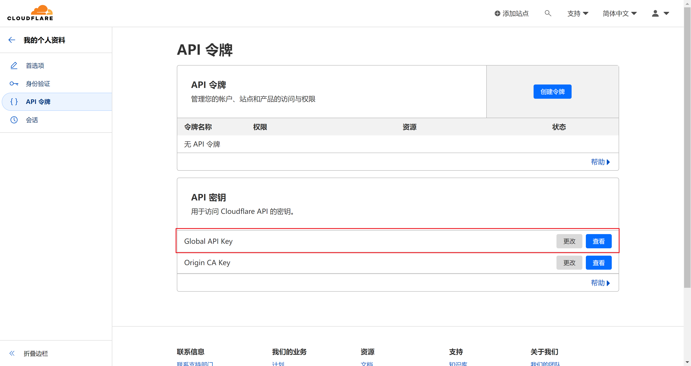

# SSL 证书申请

## 1. 使用 acme.sh 申请证书

acme.sh 项目地址：https://github.com/acmesh-official/acme.sh#readme

### 1.1. 准备工作

1. 申请一个域名。
2. 将域名托管到 Cloudflare。

### 1.2. 安装 & 卸载

#### 1.2.1. 安装 acme.sh

```sh
apt update -y
apt install -y socat

# 安装 Acme 脚本
curl https://get.acme.sh | sh -s email=my@example.com
```

安装完成后，在该目录下会生成一个 `~/.acme.sh` ACME 脚本文件夹。

#### 1.2.2. 卸载 acme.sh

```sh
~/.acme.sh/acme.sh --uninstall
```

删除完成后，需要手动删除 `~/.acme.sh` ACME 脚本文件夹。

### 1.3. 申请证书

#### 1.3.1. 使用 80 端口验证申请

确保服务器 80 端口未被使用！

```sh
~/.acme.sh/acme.sh --issue -d example.com --standalone
```

#### 1.3.2. DNS 验证申请

进入 cloudflare，获取 API 密钥



设置 Cloudflare API 令牌

```sh
export CF_Key="cloudflare_API"
export CF_Email="my@example.com"
```

颁发泛域名证书

```sh
acme.sh --issue -d example.com -d "*.example.com" --dns dns_cf
```

申请过程中没有报错，结束时当看到一长串的密钥，代表证书申请成功。

### 1.4. 安装证书到指定文件夹

默认生成的证书都放在安装目录下: `~/.acme.sh/`, 请不要直接使用此目录下的证书文件！请使用 `--install-cert` 命令，证书文件会被复制到相应的位置。

```sh
~/.acme.sh/acme.sh --install-cert -d example.com --key-file /root/cert/private.key --fullchain-file /root/cert/cert.crt
```

### 1.5. 更新证书

您不需要手动更新证书。所有证书将每 60 天自动更新一次。

```sh
# 强制更新证书
acme.sh --renew -d example.com --force
```

### 1.6. 停止更新证书

```sh
acme.sh --remove -d example.com

# 证书/密钥文件不会从磁盘中删除，需要手动删除
rm -rf ~/.acme.sh/example.com
# 你指定的证书安装路径
rm -rf PATH
```

### 1.7. 更新 Acme 脚本

```sh
# 升级 acme.sh 到最新版本
~/.acme.sh/acme.sh --upgrade

# 开启自动升级
~/.acme.sh/acme.sh --upgrade --auto-upgrade
```
