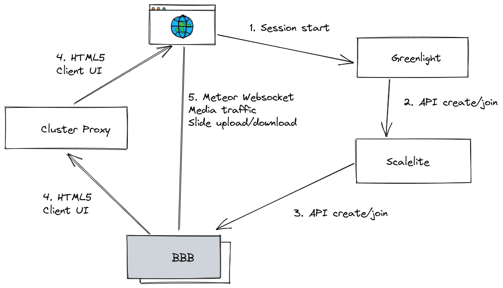
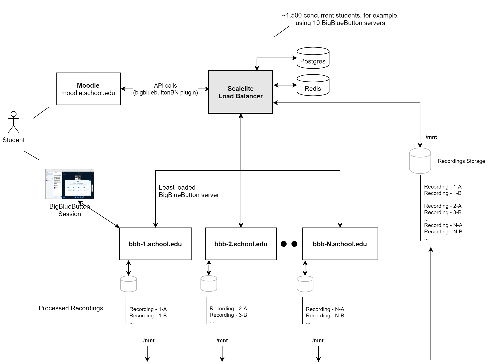

# BigBlueButton

::: tip
当前记录版本：2.7
:::

## bbb-install

### bbb-install 介绍

[bbb-install](https://github.com/bigbluebutton/bbb-install/tree/v2.7.x-release) 是一键安装 BigBlueButton 服务的脚本。

::: details 服务器要求
**用于生产环境，最低要求**：

- 运行 Linux 内核 5.x 的 Ubuntu 20.04 64 位操作系统
- 安装最新版本的 Docker
- 16 GB 内存，并启用交换分区
- 8 核 CPU，具有高单线程性能
- 500 GB 的可用磁盘空间（或更多）用于录制，如果服务器上禁用了会话录制，则需要 50 GB
- TCP 端口 80 和 443 可访问
- UDP 端口 16384 - 32768 可访问
- 250 Mbits/sec 对称带宽或更多
- TCP 端口 80 和 443 未被其他 web 服务器或反向代理占用
- 用于设置 SSL 证书的主机名（例如 bbb.example.com）
- IPV4 和 IPV6 地址

**安装在本地 VM 容器上，最低要求**：

- 4 核 CPU / 8 GB 内存
- 50 GB 磁盘空间
- 仅 IPV4 地址
  :::

### bbb-install 选项

```sh
wget -qO- https://raw.githubusercontent.com/bigbluebutton/bbb-install/v2.7.x-release/bbb-install.sh | bash -s -- [选项]

选项（安装BigBlueButton）：

  -v <version>           安装指定版本的 BigBlueButton（例如'focus-270'）（必需）

  -s <hostname>           使用 <hostname> 配置服务器
  -e <email>              用于 Let's Encrypt certbot 的邮箱

  -x                      使用 Let's Encrypt certbot 的手动 dns

  -g                      安装 Greenlight 3 版本
  -k                      安装 Keycloak 20 版本

  -t <key>:<secret>       安装 BigBlueButton LTI 框架工具并添加/更新 LTI 消费者凭证 <key>:<secret>

  -c <hostname>:<secret>  使用 <hostname> 和 <secret> 配置 coturn 服务器（而不是内置的 TURN 服务器）

  -m <link_path>          从 /var/bigbluebutton 到 <link_path> 创建符号链接

  -p <host>[:<port>]      使用 apt-get 代理在 <host>（默认端口 3142）
  -r <host>               使用替代的 apt 仓库（例如 packages-eu.bigbluebutton.org）

  -d                      跳过 SSL 证书请求（使用挂载卷中的提供的证书）在 /local/certs/
  -w                      安装 UFW 防火墙（推荐）

  -j                      允许 BigBlueButton 的安装继续，即使没有满足所有生产环境的要求。
                          请注意，不是所有的要求都可以忽略。这在开发/测试/CI场景中很有用。

  -i                      允许 BigBlueButton 的安装继续，即使安装了 Apache web 服务器。

  -h                      打印帮助
```

### bbb-install 示例

::: tip
若是本地虚拟机安装，则可通过修改 hosts 文件来模拟 DNS 域名解析。
:::

- 安装 BigBlueButton 2.7 服务（Let's Encrypt）

  ```sh
  -s <hostname>           使用 <hostname> 配置服务器（必需）
  -e <email>              为 Let's Encrypt certbot 配置邮箱（必需）
  -l                      仅安装 Let's Encrypt证书（不安装 BigBlueButton）
  -x                      使用 Let's Encrypt certbot 的手动 dns 挑战（可选）
  ```

  ```sh
  -v focal-270 -s bbb.example.com -e info@example.com
  ```

- 安装 BigBlueButton 2.7 服务（手动上传证书）

  1. 上传证书，由于使用了 `-d` 跳过了 SSL 证书请求，所以需要手动上传证书（`/local/certs/`）

     - 公钥（`crt`）改名为 `fullchain.pem`
     - 私钥（`key`）改名为 `privkey.pem`

  2. 安装 bbb

     ```sh
     -v focal-270 -s bbb.example.com -d
     ```

- 安装 BigBlueButton 2.7 服务，包括 Greenlight 3 和 Keycloak（可选的）

  ```sh
  -v focal-270 -s bbb.example.com -e info@example.com -g [-k]
  ```

- 安装 BigBlueButton 2.7 服务，包括 LTI 框架，并“添加/更新”凭证

  ```sh
  -v focal-270 -s bbb.example.com -e info@example.com -t MY_KEY:MY_SECRET
  ```

## bbb-conf

### bbb-conf 介绍

[bbb-conf](https://docs.bigbluebutton.org/administration/bbb-conf/) 是 BigBlueButton 的配置工具。

它可以修改 BigBlueButton 的部分配置、管理 BigBlueButton 系统（启动/停止/重置）以及解决设置中的潜在问题。

### bbb-config 选项

```sh
$ bbb-conf
BigBlueButton 配置工具 - 版本 2.5.2

   bbb-conf [选项]

配置:
   --version                        显示 BigBlueButton 版本（软件包）
   --setip <IP/hostname>            设置 BigBlueButton 的 IP/主机名
   --setsecret <secret>             更改 /etc/bigbluebutton/bbb-web.properties 中的共享密钥

监控:
   --check                          检查配置文件和进程是否存在问题
   --debug                          扫描日志文件中的错误消息
   --watch                          每 2 秒扫描一次日志文件中的错误消息
   --network                        查看 80、443 和 1935 端口上的网络连接（按 IP 地址）。1935 端口已弃用。如果你有自定义端口，需要修改 bbb-conf。
   --secret                         查看服务器的 URL 和共享密钥
   --lti                            查看 LTI 的 URL 和密钥（如果已安装）

管理:
   --restart                        重启 BigBlueButton
   --stop                           停止 BigBlueButton
   --start                          启动 BigBlueButton
   --clean                          重启并清理所有日志文件
   --status                         显示组件的运行状态
   --zip                            压缩日志文件以报告错误
```

## 集群搭建（官方）

### Cluster Proxy 架构



### 前期准备

1. cluster proxy 服务 -> bbb-proxy.example.com
2. bbb 服务 -> bbb-1.example.com
3. bbb 服务 -> bbb-2.example.com
4. ...
5. bbb 服务 -> bbb-n.example.com

以两台 bbb 服务为例：

### cluster server 配置

1. 以 nginx 服务作为代理，新增配置如下：

    ```nginx
    server {
      listen 443 ssl http2;
      server_name bbb-proxy.example.com;
      ssl_certificate /root/cert.crt;
      ssl_certificate_key /root/cert.key;
      charset utf-8;
    
      location /bbb-01/html5client/ {
        proxy_pass https://bbb-01.example.com/bbb-01/html5client/;
        proxy_http_version 1.1;
        proxy_set_header Upgrade $http_upgrade;
        proxy_set_header Connection "Upgrade";
        proxy_set_header Host $host;
        proxy_set_header X-Real-IP $remote_addr;
        proxy_set_header X-Forwarded-For $proxy_add_x_forwarded_for;
        proxy_set_header X-Forwarded-Proto $scheme;
      }
      
      location /bbb-02/html5client/ {
        proxy_pass https://bbb-02.example.com/bbb-02/html5client/;
        proxy_http_version 1.1;
        proxy_set_header Upgrade $http_upgrade;
        proxy_set_header Connection "Upgrade";
        proxy_set_header Host $host;
        proxy_set_header X-Real-IP $remote_addr;
        proxy_set_header X-Forwarded-For $proxy_add_x_forwarded_for;
        proxy_set_header X-Forwarded-Proto $scheme;
      }

      location / {
        root /var/www/html;
        index index.html index.htm;
      }
    }
    ```

2. *临时方案*：proxy 前端 js 模拟负载均衡。

    ```js
    let server = 'bbb-01'
    if (Math.random() > 0.5) {
      server = 'bbb-01'
    } else {
      server = 'bbb-02'
    }
    let redirect = `https://bbb-proxy.example.com/${server}/html5client/`
    window.location.href = redirect
    ```

### bbb 服务配置（bbb1 为例）

1. 新增选项到 `/etc/bigbluebutton/bbb-web.properties`：

    ```properties
    defaultHTML5ClientUrl=https://bbb-proxy.example.com/bbb-01/html5client/join
    presentationBaseURL=https://bbb-01.example.com/bigbluebutton/presentation
    accessControlAllowOrigin=https://bbb-proxy.example.com
    defaultGuestWaitURL=https://bbb-01.example.com/bbb-01/html5client/guestWait
    ```

2. 合并选项到 `/etc/bigbluebutton/bbb-html5.yml`：

    ```yml
    public:
      app:
        basename: '/bbb-01/html5client'
        bbbWebBase: 'https://bbb-01.example.com/bigbluebutton'
        learningDashboardBase: 'https://bbb-01.example.com/learning-dashboard'
      media:
        stunTurnServersFetchAddress: 'https://bbb-01.example.com/bigbluebutton/api/stuns'
        sip_ws_host: 'bbb-01.example.com'
      kurento:
        wsUrl: wss://bbb-01.example.com/bbb-webrtc-sfu
      presentation:
        uploadEndpoint: 'https://bbb-01.example.com/bigbluebutton/presentation/upload'
      pads:
        url: 'https://bbb-01.example.com/pad'
    ```

3. 创建（或编辑，如果已存在）这些单元文件：

     - `/etc/systemd/system/bbb-html5-frontend@.service.d/cluster.conf`
     - `/etc/systemd/system/bbb-html5-backend@.service.d/cluster.conf`

    每项都需要包含以下内容：

    ```
    [Service]
    Environment=ROOT_URL=https://127.0.0.1/bbb-01/html5client
    Environment=DDP_DEFAULT_CONNECTION_URL=https://bbb-01.example.com/bbb-01/html5client
    ```

4. 修改负载均衡器节点的名称以允许 CORS 请求：

    ```nginx
    set $bbb_loadbalancer_node https://bbb-proxy.example.com;
    ```

5. 修改 `/usr/share/bigbluebutton/nginx/bbb-html5.nginx` 配置：

    - 除了 `@html5clien` 之外，均需增加 bbb-html5 的挂载点（路径一定要与 cluster-proxy 一致！）
    - 为 *guest lobby* 新增一条路由。

    ```nginx
    location @html5client {
      # proxy_pass http://127.0.0.1:4100; # use for development
      proxy_pass http://poolhtml5servers; # use for production
      proxy_http_version 1.1;
      proxy_set_header Upgrade $http_upgrade;
      proxy_set_header Connection "Upgrade";
    }

    location /bbb-01/html5client/locales {
      alias /usr/share/meteor/bundle/programs/web.browser/app/locales;
    }

    location /bbb-01/html5client/compatibility {
      gzip_static on;
      alias /usr/share/meteor/bundle/programs/web.browser/app/compatibility;
    }

    location /bbb-01/html5client/resources {
      alias /usr/share/meteor/bundle/programs/web.browser/app/resources;
    }

    location /bbb-01/html5client/svgs {
      alias /usr/share/meteor/bundle/programs/web.browser/app/svgs;
    }

    location /bbb-01/html5client/fonts {
      alias /usr/share/meteor/bundle/programs/web.browser/app/fonts;
    }

    location /bbb-01/html5client/files {
      alias /usr/share/meteor/bundle/programs/web.browser/app/files;
    }

    location /bbb-01/html5client/wasm {
      types {
        application/wasm wasm;
      }
      gzip_static on;
      alias /usr/share/meteor/bundle/programs/web.browser/app/wasm;
    }

    location /bbb-01/html5client {
      gzip_static on;
      alias /usr/share/meteor/bundle/programs/web.browser;
      try_files $uri @html5client;
    }

    location /bbb-01/html5client/sockjs {
      try_files $uri @html5client;
      limit_conn ws_zone 3;
    }

    # guest lobby
    location = /html5client/locale {
      return 301 /bbb-01$request_uri;
    }
    ```

6. 创建文件 `/etc/bigbluebutton/etherpad.json`：

    ```json
    {
      "cluster_proxies": [
        "https://bbb-proxy.example.com"
      ]
    }
    ```

7. 新增 `/etc/default/bbb-web` 中的 CORS 设置：

    ```sh
    JDK_JAVA_OPTIONS="-Dgrails.cors.enabled=true -Dgrails.cors.allowCredentials=true -Dgrails.cors.allowedOrigins=https://bbb-proxy.example.com,https://bbb-02.example.com"
    ```

8. 重启 bbb 服务

    ```sh
    bbb-conf --restart
    ```

9. 测试

    访问 `https://bbb-proxy.example.com`，随机重定向至 `bbb-01/html5client/` 或 `bbb-02/html5client/`。

## 集群搭建（scalelite）

[#896](https://github.com/blindsidenetworks/scalelite/issues/896)

### scalelite 架构



## 本地部署

### 拷贝虚拟机

准备工作：

1. 下载安装 [QEMU](https://qemu.weilnetz.de/w64/)。

操作步骤：

1. **完整克隆** bbb1 虚拟机，复制 `bbb1.vmdk` 的完整路径（`D:\...\bbb1\ubuntu-20.04.6-cl3.vmdk`）。
2. 进入 VMware 安装目录，找到 `vmware-vdiskmanager.exe`，在命令行窗口中输入如下命令：

    ```sh
    # 说明：vmware-vdiskmanager.exe -r "源地址" -t 0 "存放路径和文件名称"
    .\vmware-vdiskmanager.exe -r "D:\...\bbb1\ubuntu-20.04.6-cl3.vmdk" -t 0 "D:\...\bbb1.vmdk"
    ```

3. 等待转换，当出现如下信息，说明转换成功：

    ```sh
      Convert: 100% done.
    Virtual disk conversion successful.
    ```

4. 进入 QEMU 安装目录，找到 `qemu-img.exe`，在命令行窗口中输入如下命令：

    ```sh
    # 说明：.\qemu-img.exe convert -p -f vmdk -O qcow2 "源 vmdk 文件" "转换后的 qcow2 文件"
    .\qemu-img.exe convert -p -f vmdk -O qcow2 "D:\...\bbb1.vmdk" "D:\...\bbb1.qcow2"
    ```

5. 等待转换完成，当进度为 *100%* 时说明转换完成。

## 常见问题

- **bbb-install 脚本下载失败**

  多半是网络问题，可将文件单独下载下来，再 **赋予可执行权限** 后再执行。

- **服务正常访问，但是无法加入房间，提示 400**

  证书问题，参考于 [#issues 626](https://github.com/bigbluebutton/bbb-install/issues/626)。

- **按照官方部署集群方案进行部署，资源正确加载，访问只有背景色**

  此时集群已经部署好，无法访问应该是证书问题。

## 参阅

- [BigBlueButton Docs](https://docs.bigbluebutton.org/)
- [BigBlueButton Cluster Proxy](https://docs.bigbluebutton.org/administration/cluster-proxy/)
- [scalelite](https://github.com/blindsidenetworks/scalelite)
- [VMware 导出虚拟机 vmkd 格式转换 qcow2](https://blog.csdn.net/qq_44639446/article/details/137652406)
