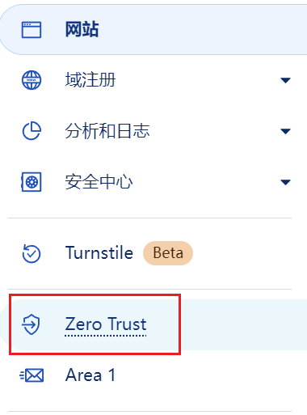
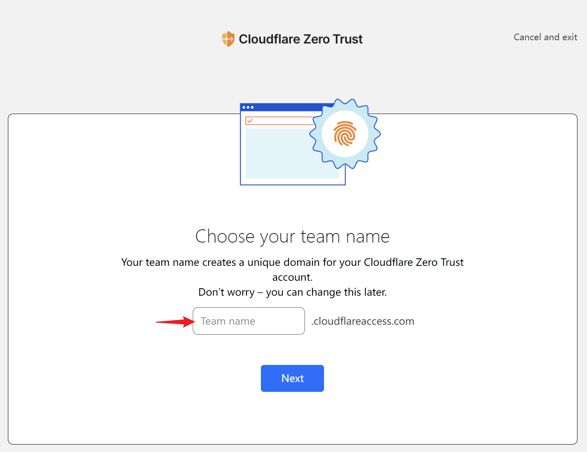

# Warp

Warp 客户端，[下载地址](https://1.1.1.1/)

## Telegram 获取 Wrap+

通过 [Warp+ Bot](https://t.me/generatewarpplusbot) 获取 key，然后进入客户端替换 key 即可。每个 key 支持 5 个设备。

## Zero Trust

1. 进入 Cloudflare 主页，选择 `Zero Trust`。

   

2. 进入页面后，填写 `Team name`。

    

3. 选择免费计划。

    

    

    虽然此时上面显示需要绑定信用卡，但其实此时会收到一封邮件，并提示已经注册好了。

    

4. 接着直接通过 cloudflare 再次重新进入 Zero Trust 主页，选择 `My Team -> Devices` 来连接设备。（如果没有显示 `Connect your first device`，点击其他选项卡后，再重新进入 `Devices` 选项卡即可）

    

    

    设置邮箱 domain，如：*@gmail.com*。（用于校验认证邮箱）

    

    选择下载 Warp 客户端（因为只有正确打开链接才能跳到下一步，如果已经下载过 Warp 客户端，打开链接确保进入下一步后关闭下载页面即可）。

    

    接着就会显示之前设置好的 `Team name`，点击 `COPY` 进入下一步。

    

    【可选】配置证书。（此时已经可以通过 Warp 客户端来登录 `Zero Trust` 账户了）

    

5. 进入 Warp 客户端，选择之前输入的 `Team name`，然后邮箱验证即可。

    
