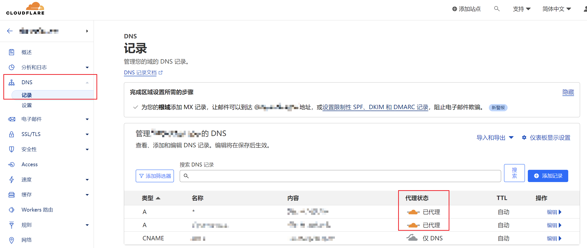
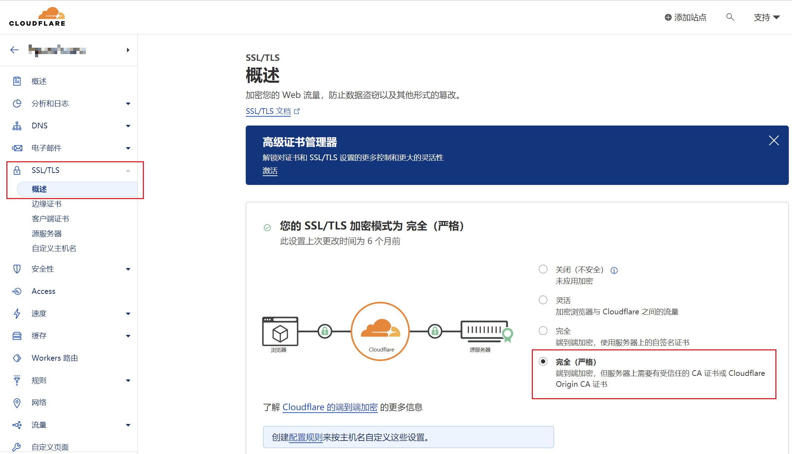
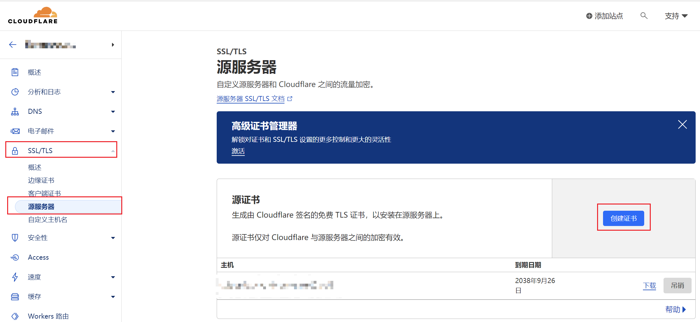
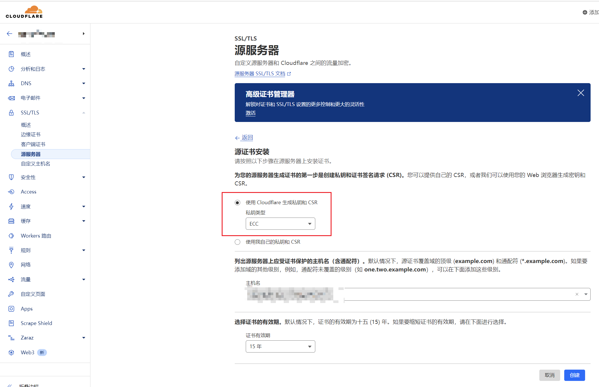
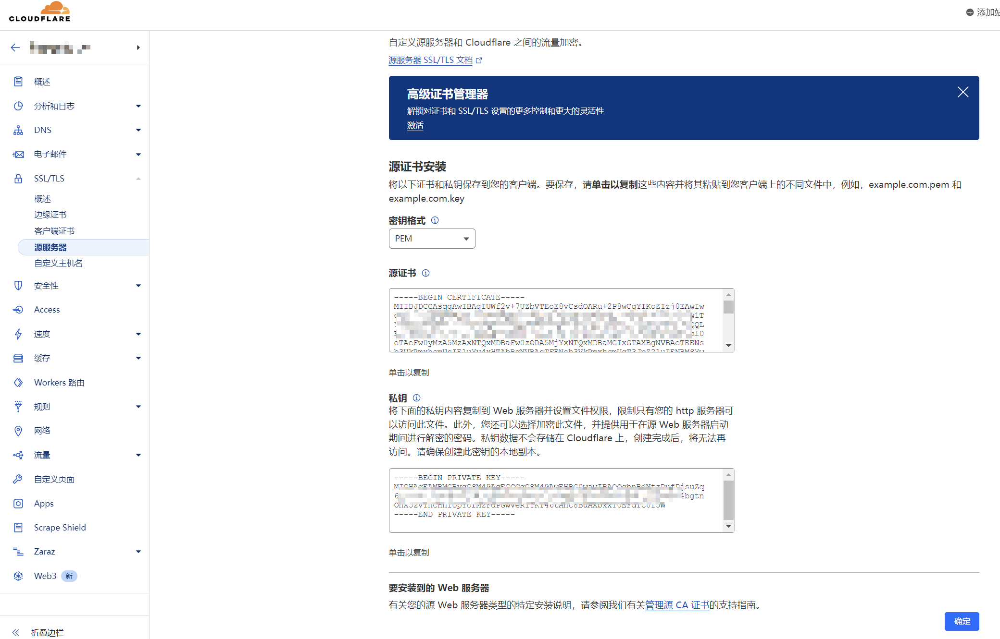

# 申请 SSL 证书

## 1. acme.sh 申请证书

参考：[acme.sh](https://github.com/acmesh-official/acme.sh#readme)

## 2. Cloudflare 申请证书

1. 使用 CF 申请的 SSL 证书，需要将域名通过 CF 进行代理。

    

2. 设置 **SSL/TLS** 加密模式为 **完全（严格）**。

    

3. 在 **源服务器** 中创建证书。

    

4. 选择私钥类型为 **ECC**，然后创建。

    

5. 保存公钥、私钥（记得备份）

    
