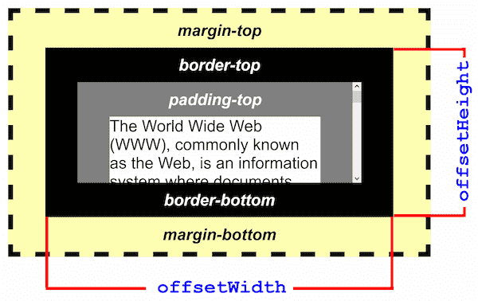

# Element

使元素被用户可见：[`scrollIntoView()`](https://developer.mozilla.org/zh-CN/docs/Web/API/Element/scrollIntoView)

## offset_client_scroll

### offset 系列

- `offsetWidth`: 只读属性，可获取元素的可见区域宽度，包括 **主体内容**、**内边距**、**边框**、**滚动条** 和 **边框**，但不包括 **外边距**。
- `offsetHeight`: 只读属性，可获取元素的可见区域高度，包括 **主体内容**、**内边距**、**边框**、**滚动条** 和 **边框**，但不包括 **外边距**。
- `offsetLeft`: 只读属性，可获取相对于其最近的定位祖先元素的左上角的偏移量(left)。
- `offsetTop`: 只读属性，可获取相对于其最近的定位祖先元素的左上角的偏移量(top)。

### client 系列

- `clientWidth`: 只读属性，可获取元素的内容区域宽度，包括 **主体内容** 和 **内边距**，但不包括 **滚动条**、**边框** 和 **外边距**。
- `clientHeight`: 只读属性，可获取元素的内容区域高度，包括 **主体内容** 和 **内边距**，但不包括 **滚动条**、**边框** 和 **外边距**。
- `clientLeft`: 只读属性，可获取元素的 **左边框** 的宽度。
- `clientTop`: 只读属性，可获取元素 **上边框** 的高度。

### scroll 系列

- `scrollWidth`: 只读属性，可获取元素的内容区域宽度，包括由于溢出而在屏幕上不可见的内容。如果不使用滚动条，宽度的测量方式与 `clientWidth` 相同。
- `scrollHeight`: 只读属性，可获取元素的内容区域高度，包括由于溢出而在屏幕上不可见的内容。如果不使用滚动条，宽度的测量方式与 `clientHeight` 相同。
- `scrollLeft`: 可获取或者设置元素滚动条到元素左边的距离。
- `scrollTop`: 可获取或者设置元素滚动条到元素顶部的距离。
