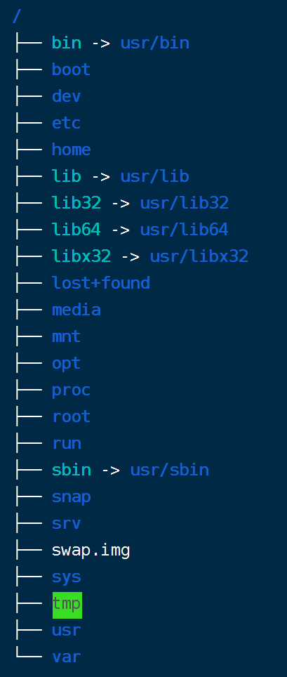

# 文件目录

## 1. 目录介绍



- **系统启动必须**
  - `/boot/`：系统引导程序加载所需文件。
  - `/etc/`：系统管理所需的配置文件。
  - `/lib/`：系统共享库。
  - `/sys/`：系统内核文件。

- **指令集合**
  - `/bin/`：可执行命令。
  - `/sbin/`：类似于 `/bin/`，存放系统管理员使用的执行命令。

- **外部文件管理**
  - `/dev/`：设备文件。
  - `/media/`：可移动媒体（CD、usb）文件挂载点。
  - `/mnt/`：临时挂载点。

- **临时文件**
  - `/run/`：临时文件系统，存储系统启动以来的信息，系统重启后，该目录下的原文件被清除。
  - `/lost+found/`：系统崩溃后存储损坏文件的地方。
  - `/tmp/`：临时存储文件夹，存储在该目录下的文件在下次开机后被清除。

- **用户管理**
  - `/root/`：root 用户主目录。
  - `/home/`：个人用户主目录，每个用户都有一个自己的目录，以用户名命名。
  - `/usr/`：共享资源目录（unix shared resources），用户很多程序和文件都存储在该目录下。

- **运行所需**
  - `/proc/`：伪文件系统。系统关闭时会消失，系统启动时会创建的目录，在该目录下，每个活动进程都有一个专门的目录来进行管理。
  - `/var/`：存放经常修改的数据，比如程序运行的日志文件 `/var/log`。

- **拓展**
  - `/opt/`：很少使用，通常是软件供应商放置可选软件包的地方。
  - `/srv/`：存放一些服务启动之后需要提取的数据。

## 2. 文件和目录管理

- `cd`：更改当前工作目录。
- `ls`：列出目录中的文件和子目录。
- `touch`：创建或更新指定文件。
- `mkdir`：创建新目录。
- `cp`：复制文件或目录。
- `mv`：移动或重命名文件或目录。
- `rm`：删除文件或目录。
- `vi`：纯文本编辑器。
- `cat`：连接文件并打印到标准输出设备上。

## 3. 打包/压缩

### 3.1. tar

- `-c`, `--create` 创建一个新归档。
- `-x`, `--extract`, `--get` 从归档中解出文件。
- `-z`, `--gzip`, `--gunzip`, `--ungzip` 通过 gzip 过滤归档。
- `-v`, `--verbose` 详细地列出处理的文件。
- `-f` 后面紧跟归档文件的名称。

```sh
# 指定的文件或目录打包成 filename.tar.gz 文件，并自动压缩
tar -czvf filename.tar.gz file/directory

# 将 filename.tar.gz 文件解压缩到当前目录下
tar -xzvf filename.tar.gz`
```

### 3.2. zip

```sh
# 将指定的文件或目录打包成 filename.zip 文件
zip -r filename.zip file/directory

# 将 filename.zip 文件解压缩到当前目录下
unzip filename.zip
```

### 3.3. gzip

```sh
# 将 filename 文件压缩成 filename.gz 文件
gzip filename

# 将 filename.gz 文件解压缩成 filename 文件
gunzip filename.gz
```

### 3.4. bzip2

```sh
# 将 filename 文件压缩成 filename.bz2 文件
bzip2 filename

# 将 filename.bz2 文件解压缩成 filename 文件
bunzip2 filename.bz2
```

### 3.5. 7z

```sh
# 安装 7z 命令
apt update && apt install p7zip-full

## 将指定的文件或目录打包成 filename.7z 文件
7z a -t7z filename.7z file/directory

## 将 filename.7z 文件解压缩到当前目录下
7z x filename.7z
```
