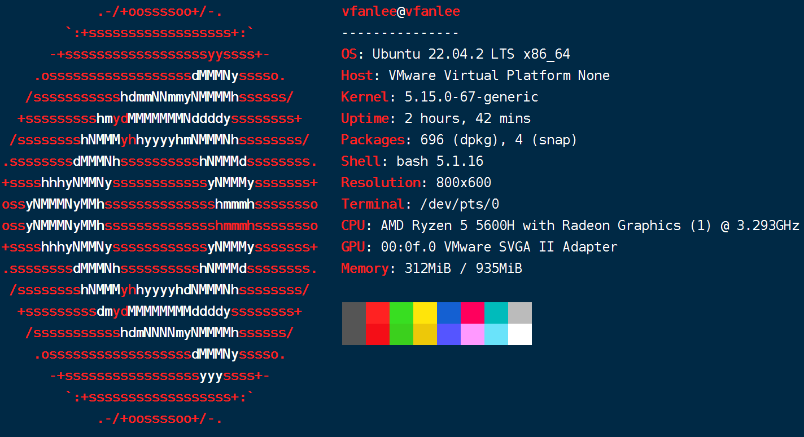

# 系统管理

- `neofetch` 会显示 Linux 系统信息，如下图所示：

    

- `systemctl`：控制系统服务和守护进程。
- `uname`：显示系统名称和版本号。
- `top`：显示正在运行的进程和资源使用情况。
- `ps`：列出当前用户的进程。
- `kill`：终止进程。
- `free`：显示系统内存使用情况。
- `vmstat`：显示虚拟内存统计信息。

## 环境变量

- 使用 `env` 查看环境变量。
- 使用 `export VAR=value` 临时设置环境变量。
- 使用 `unset VAR` 删除环境变量。
- 在脚本或终端中，可以使用 `$VAR` 或 `${VAR}` 语法来引用环境变量的值。
- 在脚本或终端中，可以使用 `${VAR:-default}` 语法来获取环境变量的值。如果环境变量未设置，则使用 default 作为默认值。

### 实例

```sh
export http_proxy=http://proxyAddress:port # 临时设置 http 代理
export https_proxy=http://proxyAddress:port # 临时设置 https 代理

unset http_proxy # 临时删除 http 代理
unset https_proxy # 临时删除 https 代理
```
