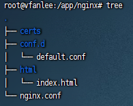

# Docker 安装 nginx

1. 创建 nginx 目录，并赋予权限。

    ```sh
    mkdir -p /app/nginx
    ```

2. 申请证书。

    参考：[申请 SSL 证书](申请证书)

    ```sh
    mkdir -p /app/nginx/certs
    # 公钥
    cd /app/nginx/certs && vi cert.pem
    # 私钥
    cd /app/nginx/certs && vi key.pem
    ```

3. 建立基本目录结构。

   - Template 参考：
     - [nginx.conf](/expand/nginx/template/nginx.conf)
     - [default.conf](/expand/nginx/template/default.conf)

    

4. 部署容器

    [Nginx 镜像](https://hub.docker.com/_/nginx)

    ```sh
    docker network create nginx-network
    docker container run -d \
                         --name nginx-container \
                         --network nginx-network \
                         --publish 80:80 \
                         --publish 443:443 \
                         --volume /app/nginx/nginx.conf:/etc/nginx/nginx.conf \
                         --volume /app/nginx/conf.d:/etc/nginx/conf.d \
                         --volume /app/nginx/html:/usr/share/nginx/html \
                         --volume /app/nginx/certs:/etc/nginx/certs \
                         --restart=always \
                         nginx:latest
    ```

5. 自定义 nginx 配置

   - 参考：[代理静态页面](/expand//nginx/template/代理静态页.conf)
   - 参考：[反向代理](/expand//nginx/template/反向代理.conf)
   - 参考：[重定向](/expand//nginx/template/重定向.conf)
