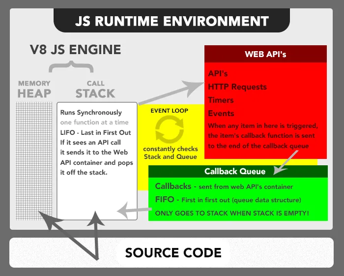

# 事件循环

总所周知，JavaScript 是单线程的，而事件循环是 JavaScript 实现异步的具体解决方案。

## JavaScript 为什么是单线程？

JavaScript 作为浏览器脚本语言，最主要的用途就是与用户交互，操作 DOM。

若设计为多线程，会带来复杂的同步问题，比如：此时有两个线程，一个线程在某个节点上添加了一段内容，一个线程删除了该节点，此时浏览器该以哪个线程为主？

因此，为了避免其复杂性，JavaScript 在设计之初就是单线程。

## JavaScript 如何实现异步？

JavaScript 作为一门单线程语言，异步能力由 JavaScript Runtime (Environment) 所决定。

### The Heap

第一个容器是 V8 JS 引擎的一部分，称为“内存栈”。当 V8 JS 引擎在代码中遇到变量和函数声明时，会将它们存储在 **栈** 中。

### The Stack

第二个容器是 V8 JS 引擎的一部分，称为“调用堆”。当 JS 引擎遇到可操作项（例如函数调用）时，会将其添加到 **堆** 中。

一旦函数被添加到堆栈中，JS 引擎就会立即跳入并开始解析其代码，将变量添加到堆中，将新函数调用添加到堆栈顶部，或将自身发送到 Web API 调用所在的第三个容器。

### The Web API Container

### The Callback Queue

### The Event Loop
