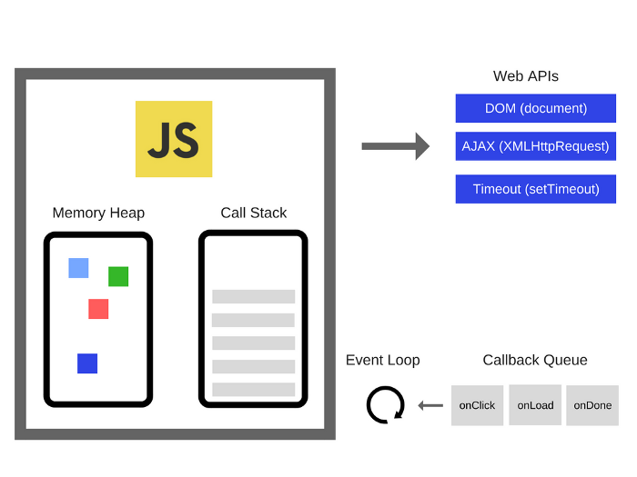

# 异步机制

> 参考：
>
> - [The Javascript Runtime Environment](https://medium.com/@olinations/the-javascript-runtime-environment-d58fa2e60dd0)
> - [Understanding the JavaScript runtime environment](https://medium.com/@gemma.croad/understanding-the-javascript-runtime-environment-4dd8f52f6fca)
> - [Node.js animated: Event Loop](https://dev.to/nodedoctors/an-animated-guide-to-nodejs-event-loop-3g62)

总所周知，JavaScript 是单线程的，而事件循环机制是 JavaScript 实现异步的具体解决方案。

## JavaScript 为什么是单线程？

首先，JavaScript 作为浏览器脚本语言，在设计之初，最主要的用途就是与用户交互，操作 DOM。

想象一个场景：若设计为多线程，此时有两个线程，一个线程在某个节点上添加了一段内容，一个线程删除了该节点，此时浏览器该以哪个线程为主？

因此，为了避免线程同步的复杂度，JavaScript 在设计之初就是单线程。

## JavaScript 如何实现异步？

JavaScript 作为一门单线程语言，异步能力由 JavaScript Runtime (Environment) 所决定。

在浏览器（Chrome 为例）中， JavaScript Runtime 由以下几个部分组成：

1. **内存栈（Call Stack）**：内存栈是 JavaScript 引擎（例如 V8 引擎）提供的一部分，用于管理函数调用和执行上下文。它跟踪函数的调用顺序和变量的作用域。
2. **内存堆（Heap）**：内存堆也是 JavaScript 引擎（例如 V8 引擎）提供的一部分，用于存储动态分配的对象和数据，例如对象、数组和闭包等。
3. **Web APIs**：**Web APIs 不属于 JavaScript 引擎**，而是浏览器提供的一组外部 API，用于访问浏览器功能和与浏览器环境交互。这包括 DOM 操作、定时器、AJAX 请求等。
4. **任务队列（Task Queue）**：任务队列通常包括 **宏任务队列（macrotask queue）** 和 **微任务队列（microtask queue）** 两部分。宏任务队列包括定时器回调、事件处理器、网络请求等异步任务，而微任务队列包括 Promise 回调和 Mutation Observer 回调等。这些队列用于存储异步任务，等待事件循环处理。
5. **事件循环（Event Loop）**：**事件循环是浏览器中用于协调和处理异步任务的核心机制**。它不仅负责处理任务队列中的任务，还会不断检查任务队列，确保任务按照正确的顺序执行。事件循环也包括一些规则，例如宏任务优先于微任务。

## 常见的宏任务，微任务

宏任务

| 类型                  | 浏览器 | Node |
| --------------------- | ------ | ---- |
| I/O                   | ✅      | ✅    |
| setTimeout            | ✅      | ✅    |
| setInterval           | ✅      | ✅    |
| setImmediate          | ❌      | ✅    |
| requestAnimationFrame | ✅      | ❌    |

微任务

| 类型                       | 浏览器 | Node |
| -------------------------- | ------ | ---- |
| process.nextTick           | ❌      | ✅    |
| MutationObserver           | ✅      | ❌    |
| Promise.then catch finally | ✅      | ✅    |
