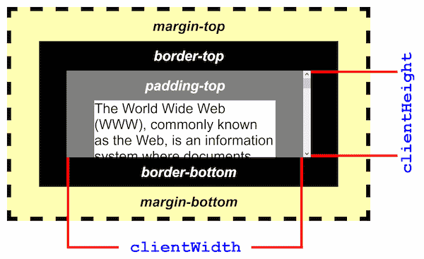
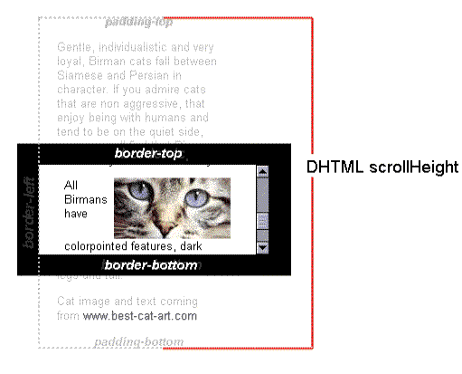

# 大小位置

## offset 系列

- `offsetWidth`: 元素的可见区域宽度，包括 **主体内容**、**内边距**、**边框**、**滚动条** 和 **边框**，但不包括 **外边距**。
- `offsetHeight`: 元素的可见区域高度，包括 **主体内容**、**内边距**、**边框**、**滚动条** 和 **边框**，但不包括 **外边距**。
- `offsetLeft`: 相对于其最近的定位祖先元素的左上角的偏移量(left)。
- `offsetTop`: 相对于其最近的定位祖先元素的左上角的偏移量(top)。

## client 系列

- `clientWidth`: 元素的内容区域宽度，包括 **主体内容** 和 **内边距**，但不包括 **滚动条**、**边框** 和 **外边距**。
- `clientHeight`: 元素的内容区域高度，包括 **主体内容** 和 **内边距**，但不包括 **滚动条**、**边框** 和 **外边距**。
- `clientLeft`: 元素的 **左边框** 的宽度。
- `clientTop`: 元素 **上边框** 的高度。

## scroll 系列

- `scrollWidth`: 元素的内容区域宽度，包括由于溢出而在屏幕上不可见的内容。如果不使用滚动条，宽度的测量方式与 `clientWidth` 相同。
- `scrollHeight`: 元素的内容区域高度，包括由于溢出而在屏幕上不可见的内容。如果不使用滚动条，宽度的测量方式与 `clientHeight` 相同。
- `scrollLeft`: 元素滚动条到元素左边的距离。
- `scrollTop`: 元素滚动条到元素顶部的距离。

## 鼠标位置

- `event.clientX/x/clientY/y`：以浏览器窗口（视口）左上顶角为原点，定位 x/y 轴坐标，单位是像素。
- `event.pageX/pageY`：以 document 对象（文档窗口）左上顶角为原点，定位 x/y 轴坐标，单位是像素。包括滚动条的偏移量。
- `event.screenX/screenY`：以计算机屏幕左上顶角为原点，定位 x/y 轴坐标，单位是像素。
- `event.offsetX/offsetY`：以当前事件的目标对象左上顶角为原点，定位 x/y 轴坐标，单位是像素。受 CSS transform 的影响。
- `event.layerX/layerY`：以最近的绝对定位的父元素（如果没有，则为 document 对象）左上顶角为元素，定位 x/y 轴坐标，单位是像素。包括滚动条的偏移量，受 CSS transform 的影响。
