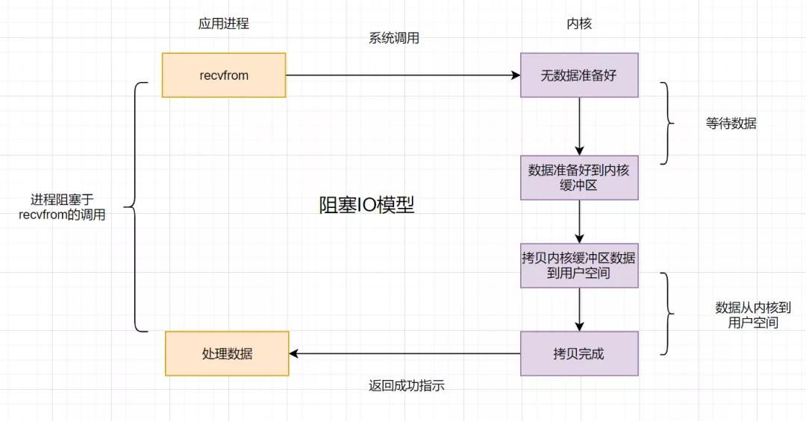
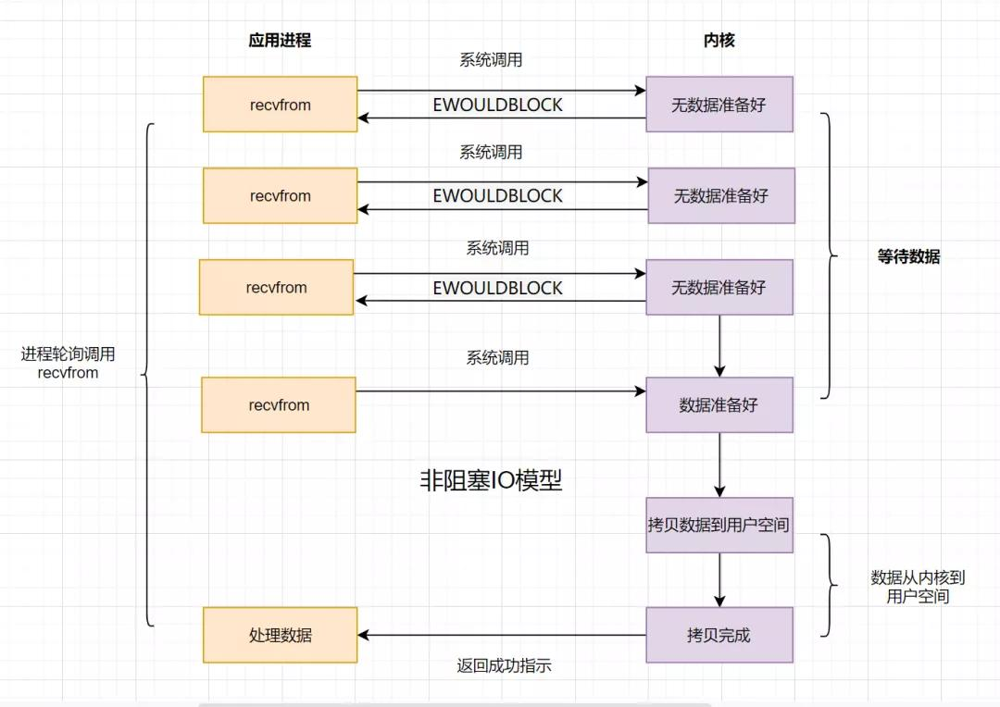
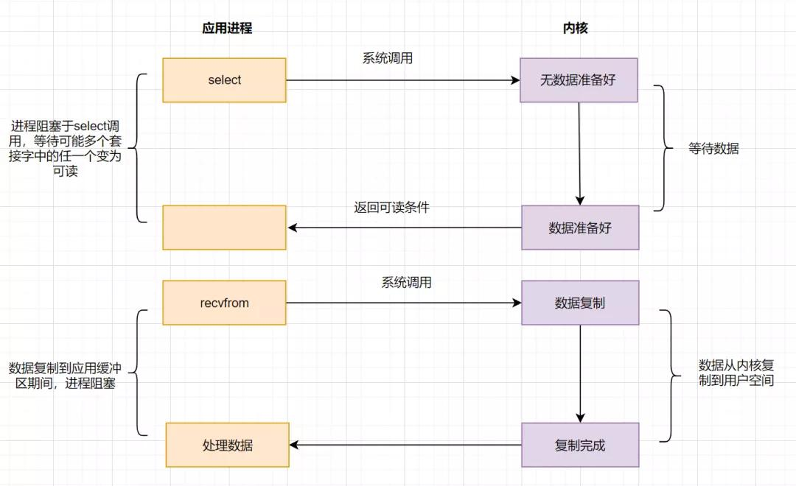
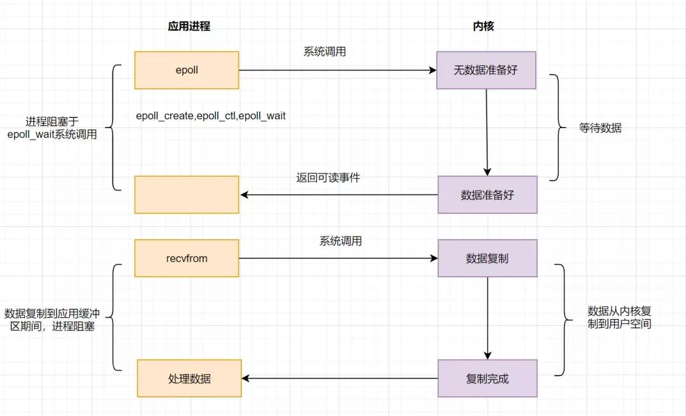
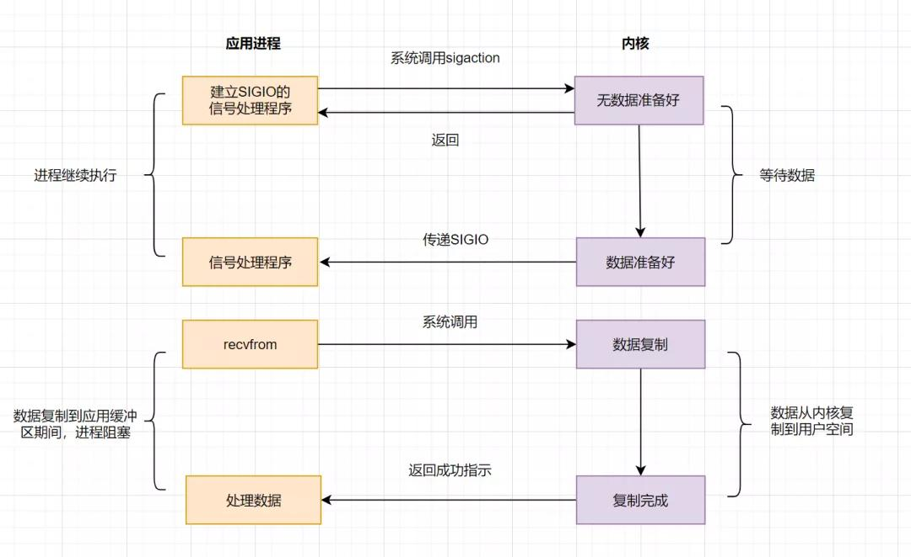
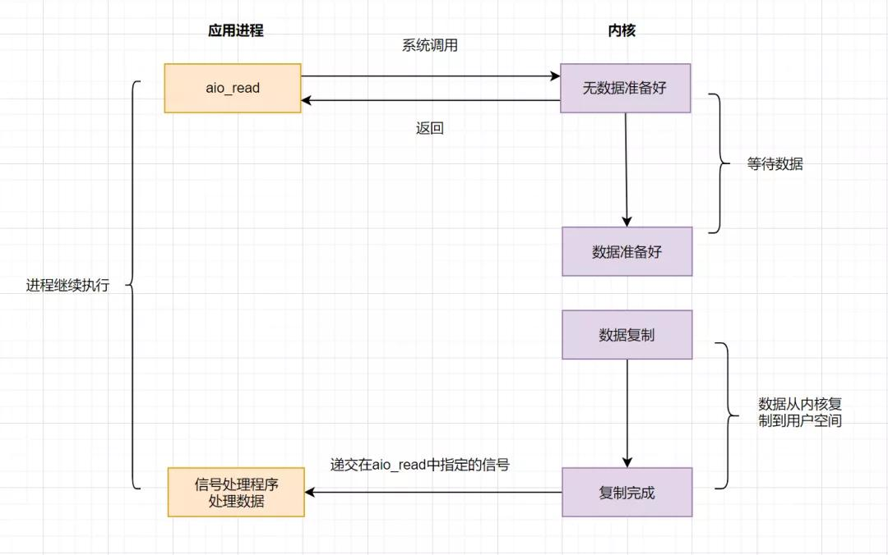

# IO 模型

## 什么是 IO ？

I/O 即 Input/Output，直译过来就是输入/输出。

从计算机层面来看，鼠标键盘等输入设备会将指令输入给主机，主机将运算结果反馈在显示器或者打印机等输出设备上，这个过程就是一次 IO。

IO 操作一般会根据不同类型分为不同类型的 IO，如：内存IO，网络IO，和磁盘IO ……。

## IO 模型

IO 模型可以分为 5 种：

  1. 阻塞 IO 模型
  2. 非阻塞 IO 模型
  3. 多路复用 IO 模型
  4. 信号驱动 IO 模型
  5. 异步非阻塞 IO 模型

### 阻塞 IO 模型

### 非阻塞 IO 模型

### 多路复用 IO 模型

select

poll

epoll

### 信号驱动 IO 模型

### 异步非阻塞 IO 模型

