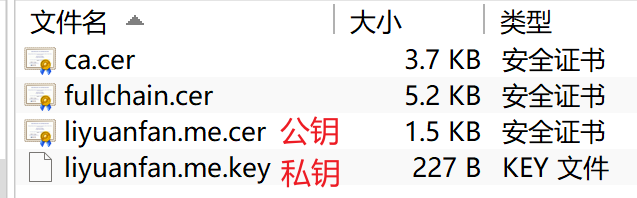

# 搭建步骤

> https://v2rayssr.com/teach-vless.html#%E5%AE%9E%E6%88%98%E7%AF%87

## 基本环境

1. 购买 VPS。
2. 注册域名。
3. 域名托管 Cloudflare（可选，优质 vps 可忽略）
4. 域名解析。

## 部署 x-ui

### ssl 证书申请

```bash
x-ui
16 # 一键申请 ssl 证书，根据提示一步一步来即可
```

成功之后，在 `/root/cert` 下可以查看申请的证书。



接着在 x-ui 面板中填写公钥、私钥路径即可。

### 添加入站协议
