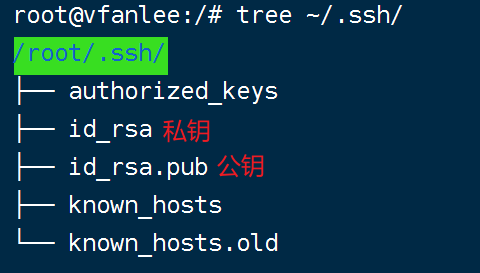

# Git

## 1. Git 安装

下载地址：https://git-scm.com/downloads

## 2. Git 全局配置

所有的全局配置在 `~/.gitconfig` 中都可查看。

### 2.1. 用户名/邮箱设置

安装完 Git 之后，要做的第一件事就是设置你的用户名和邮件地址。 这一点很重要，因为每一个 Git 提交都会使用这些信息，它们会写入到你的每一次提交中，不可更改。

```bash
git config --global user.name "VfanLee"
git config --global user.email "fanfanfafafa@gmail.com"
```

### 2.2. 代理配置

```bash
git config --global https.proxy https://127.0.0.1:7890 # 设置 https 代理
git config --global --unset https.proxy # 取消代理
```

### 2.3. 设置 SSH

> 使用 SSH 可以实现免密登录，提交代码时就无需输入账号密码了。

### 2.4. 生成 ssh 密钥

```bash
ssh-keygen -t rsa -C VfanLee  # 紧接之后三次回车即可
```

成功执行后，会生成 `~/.ssh` 文件夹，包含公钥、私钥等文件。



再将公钥添加至 GitHub/GitLab 中。
