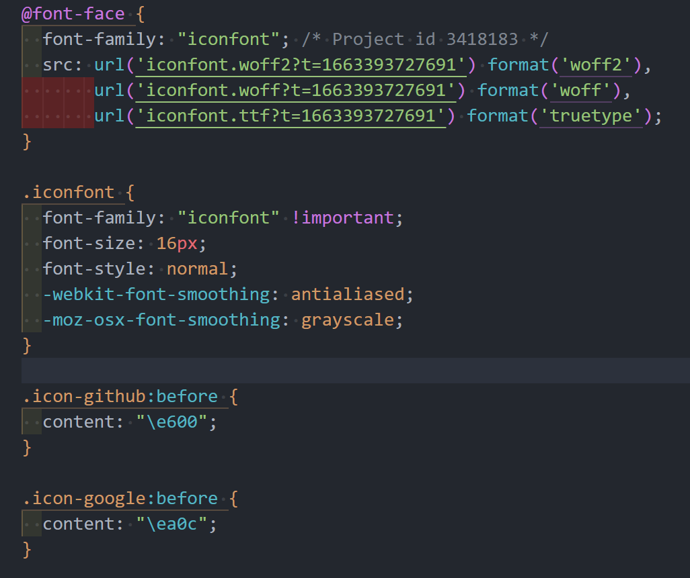

# 引入图标

## 1. Unicode、Font class、Symbol

这几种方式都是通过操作标签来引入，比较常用。

## 2. 伪元素插入字体图标

在有些情况下，可能需要加上字体图标，但是组件由来自第三方，无法直接添加标签，那么如何处理？

其实这种方式的思路也来源于对 `iconfont.css` 的思考，下载下来的 `iconfont.css` 文件如下：



它其实就是根据 `@font-face` 自定义了一套字体，接着定义一个 iconfont 类名，定义基本的图标样式，再通过不同类名，如：`icon-github`、`icon-google` …… 给伪元素设置 `content` 内容，来定义不同的图标类型。所以一般在使用的时候，我们直接添加 class 就可以引入图标了。

了解原理后，我们在使用的时候，就可以直接跳过封装类名的这一步，我们引入 iconfont 字体后，手动给某个元素的伪元素设置 content 即可。

```css
/* 1.引入 iconfont 字体 */
@import url(./iconfont/iconfont.css);

/* 2.给需要的元素指定 iconfont 字体 */
.foo::before {
  font-family: 'iconfont';
  content: '\e600';
}
```

## 3. 伪元素设定图片背景

插入图标时，可能找不到需要的图标，而且也依赖于字体文件，于是就可以采用图片作为伪元素背景的方式。

```css
.foo::after {
  content: '';
  display: inline-block;
  width: 16px;
  height: 16px;
  background: url(./fe.png) no-repeat scroll center / cover;
}
```
