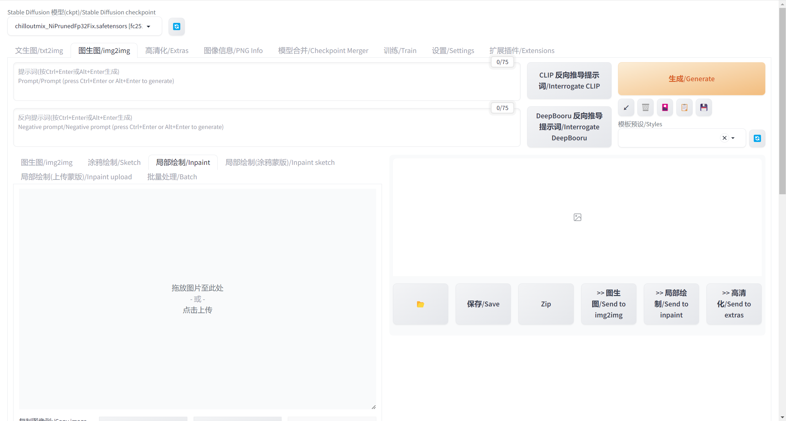
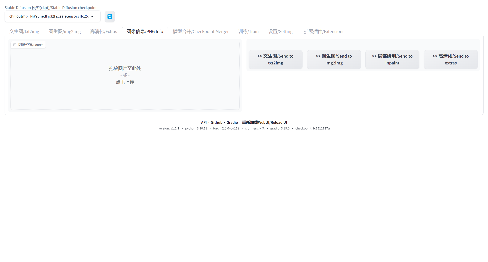
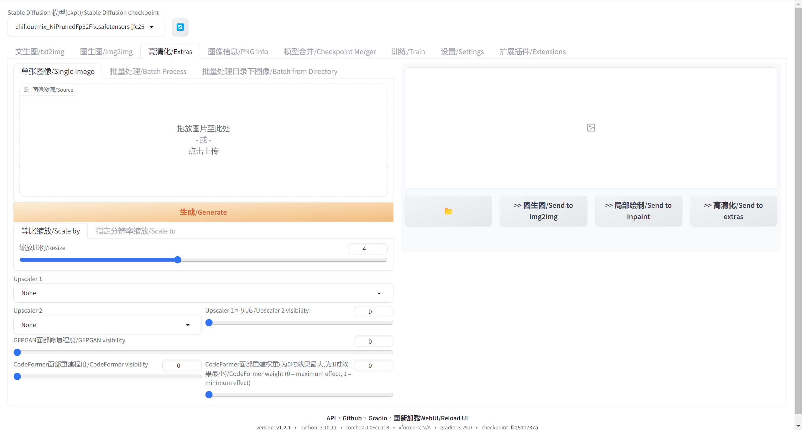
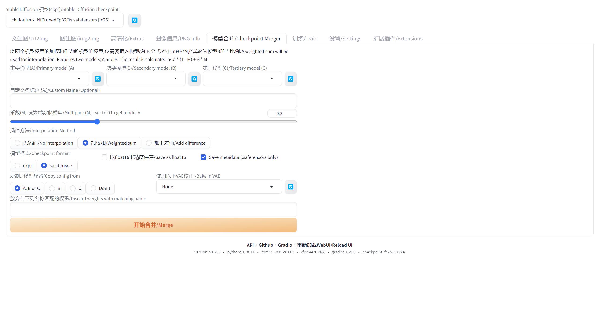
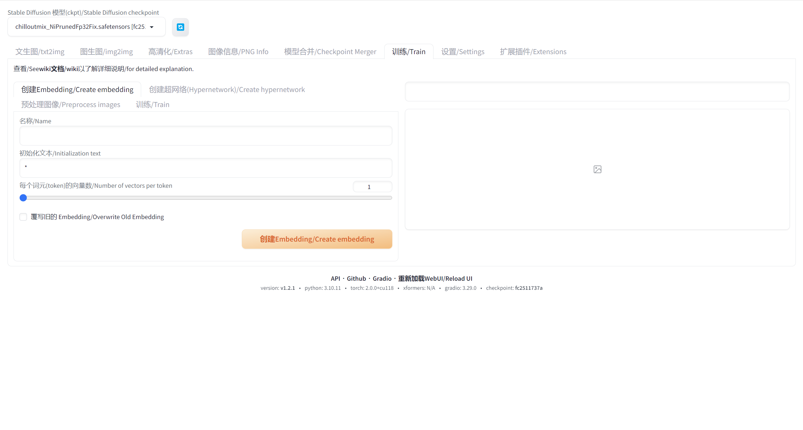
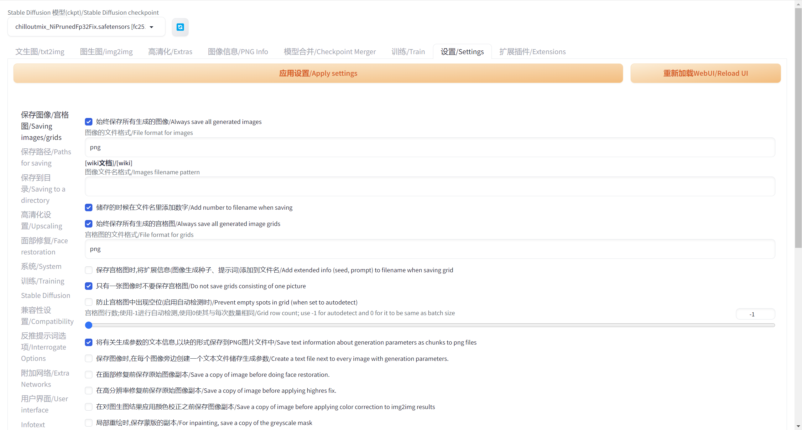
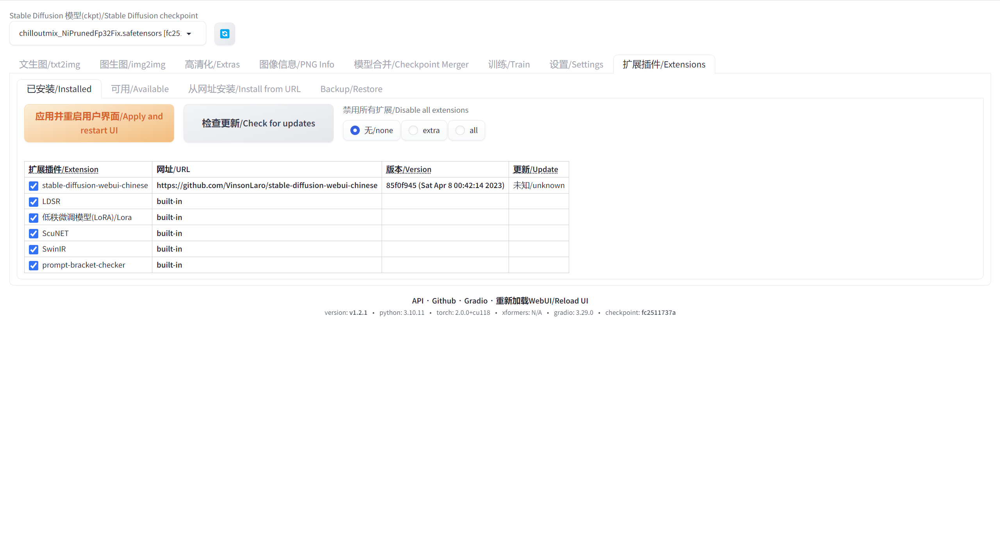

# stable-diffusion-webui

## 安装

### Windows 安装

1. 安装 Python 3.10.6（较新版本的 Python 不支持 torch），选中“将 Python 添加到 PATH”。
2. 安装 git。
3. 下载 stable-diffusion-webui 存储库，例如通过运行 `git clone https://github.com/AUTOMATIC1111/stable-diffusion-webui.git`。
4. 以正常、非管理员、用户身份从 Windows 资源管理器运行 webui-user.bat。

## SD WebUI 界面

`Stable Diffusion 模型(ckpt)/Stable Diffusion checkpoint`：当前使用的模型。

`文生图/txt2img`：按照文本叙述生图。

`图生图/img2img`：参照现有的图片生图

`图像信息/PNG Info`：显示生成图片所使用的模型、提示词等信息。如果有人分享
未修改过的 SD WebUI 图片，那么你只要把它下载下来，在此界面上传图片，即会显示该图片背后使用的提示词。

`高清化/Extras`：AI放大技术。如果用缺省的 512x512 分辨率就生出不错的图，
可以将图片放到 Extras 进行放大。

`模型合并/Checkpoint Merger`：合并不同的模型，生成新的模型。

`训练/Train`：训练辅助扩展，它可以帮助你快速、直观地训练 Lora 等模型。你可以使用这个功能来训练你自己的模型。

`设置/Settings`：设置页面。

`扩展插件/Extensions`：扩展插件管理页面。

## 模型

模型下载好后，存档至 `models/Stable-diffusion` 文件夹中生效。

常见模型下载网站：

- [civitai](https://civitai.com)
- [HuggingFace](https://huggingface.co/models?other=stable-diffusion)

## 其他 AI 绘图软件

- [Midjourney](https://www.midjourney.com/)
- [zoned](https://zoned.ai/home)
