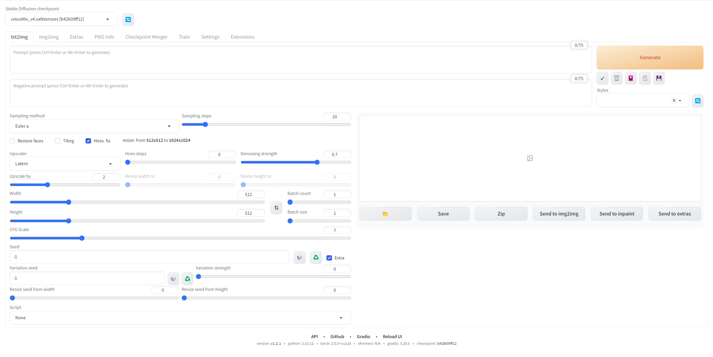

# 文生图/txt2img 参数详解

## Prompt

Prompt 指的是正向提示词，在这里来描述想要生成的东西。

## Negative Prompt

Negative Prompt 指的是反向提示词，在这里来描述不想生成的东西。

## Sampling Methods

Sampling Methods 指的是采样方法或者说是采样器，Stable Diffusion 每次生图都有一个降噪过程，而这个参数指的是您需要使用哪个采样方法来进行降噪，不同采样方法得出的结果也不太一样。

## Sampling Steps

Sampling Steps 指的是采样迭代步数，必须有足够迭代步数，才能获得我们人眼可识别的图像，但是也并非越高越好，采样步骤越高，每张图像的处理时间越长，对硬件的要求也更高，而且在某个阈值下，添加到图像中的细节量达到峰值，超过此值的额外采样步数反而会降低图像的质量，并不会继续改善图像的质量。所以我们在生图时，需要多多尝试，从低步开始，来慢慢进行增长。在 Stable Diffusion Web UI 中，默认就是20，大多数情况迭代步数 20-30 步就可以了。

## Restore faces

Restore faces 顾名思义就是用来改善脸部生成效果。

## Tiling

Tiling 可生成无缝重复模式的图像。

## Hires_fix

Hires_fix 指的是高分辨率修复，可以提升图片的画质，会耗费更多的显存（VRAM），生图时间也更长。

还有一种方式就是我们先简单生图，生成我们满意的图片之后，我们再将图片发送到 [Extras 选项页](assets/extras.png)，然后再进行高清化处理。

## Width/Height

Width/Height 顾名思义就是生成图片的宽高。

## Batch count / Batch size

Batch count 和 Batch size 这两者非常相似。

- Batch count 从生图过程中来看，就是一张一张地生成。
- Batch size 从生图过程中来看，就是一次性生成多少张。

## CFG Scale

CFG Scale 即 Classifier-free guidance scale，指的是提示词的引导系数。

理论上，CFG 值越高，它就越严格地按照 Prompt 进行操作。默认值为 7，这在创作自由和遵循您的方向之间提供了良好的平衡。值为 1 将赋予 Stable Diffusion 几乎完全的自由度，而高于 15 的值则相当受限。

## Seed

Seed 指的是生成图片的种子码。将种子码保存下来有助于保留生图的风格。

点击骰子图标，设置成 -1 即为重置种子码。

回收符号则是叫出上一次生图所使用的种子码。

## Extra

Extra 开启后可以对种子设置更多选项。

### Variation seed

Variation seed 指的是变异种子，规则和 seed 一致。

### Variation strength

Variation strength 指的是变异种子和原种子的差异强度，为 0 时为原种子，为 1 时是新种子。

### Resize seed from width / Resize seed from height

Resize seed from width 和 Resize seed from height 可调整种子大小，即使使用相同的种子，如果更改图像大小，图像也会发生显着变化。此设置可尝试在调整图像大小时修复图像的内容。

## Scripts

Scripts 可以选择加载用户撰写的指令稿。内置的有：

- `Prompt Matrix`：会生出一个 grid 图片，用于比对不同提示词生图的效果。
- `Prompts from files or textbox`：从写好提示词的文件生成图片。
- `X/Y/Z plot`：用于比对不同提示词、采样方法、CFG Scale、种子码的组合所生图的效果。

## 生成选项区

Generate 生图按钮，快捷操作是 `Ctrl + Enter` 或者 `Alt + Enter`。

其下方 5 个按钮由左至依序为：

1. 从提示词中读取生成参数,如果提示词为空,则读取上一次的生成参数到用户界面。
2. 从提示词中读取生成参数,如果提示词为空,则读取上一次的生成参数到用户界面。
3. 清空提示词。
4. 激活额外网络。
5. 套用选中的 style。
6. 保存目前的 style，会保存在 Stable Diffusion Web UI 项目路径下的 styles.csv 文件中。其下方的 Styles 列表即为保存的 style。

## 生图结果区

展示生图结果。

其下方 6 个按钮由左至依序为：

1. 打开生图文件夹。
2. 保存图片。
3. ZIP压缩保存图片。
4. Send to img2img：将生图结果发送到 img2img 选项页做进一步处理。
5. Send to inpaint：将生图结果发送到 img2img 选项页的 inpaint 选项卡中做进一步处理。
6. Send to extras：将生图结果发送到 extras 选项页做进一步处理。
