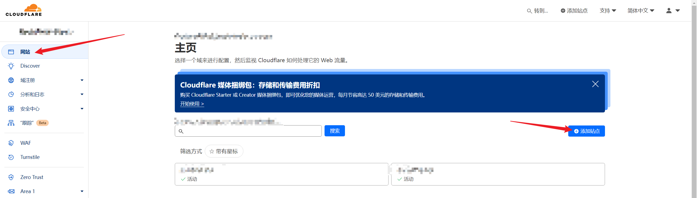
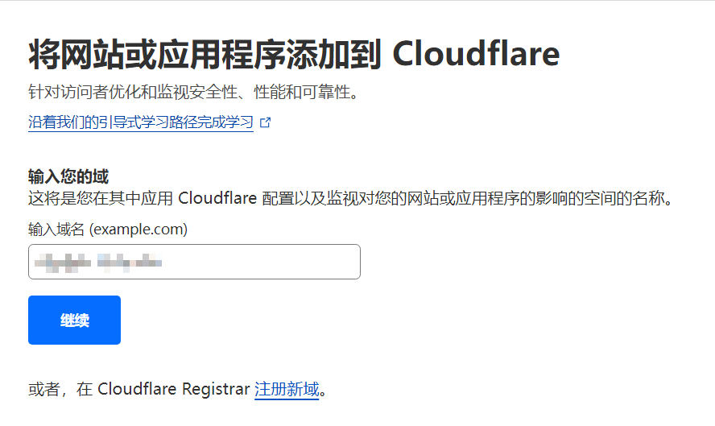
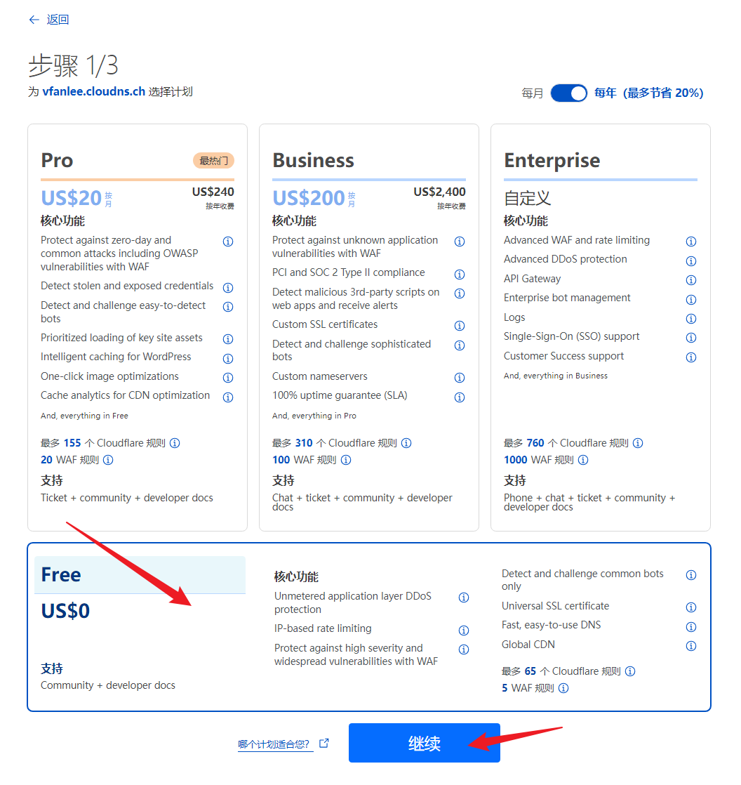
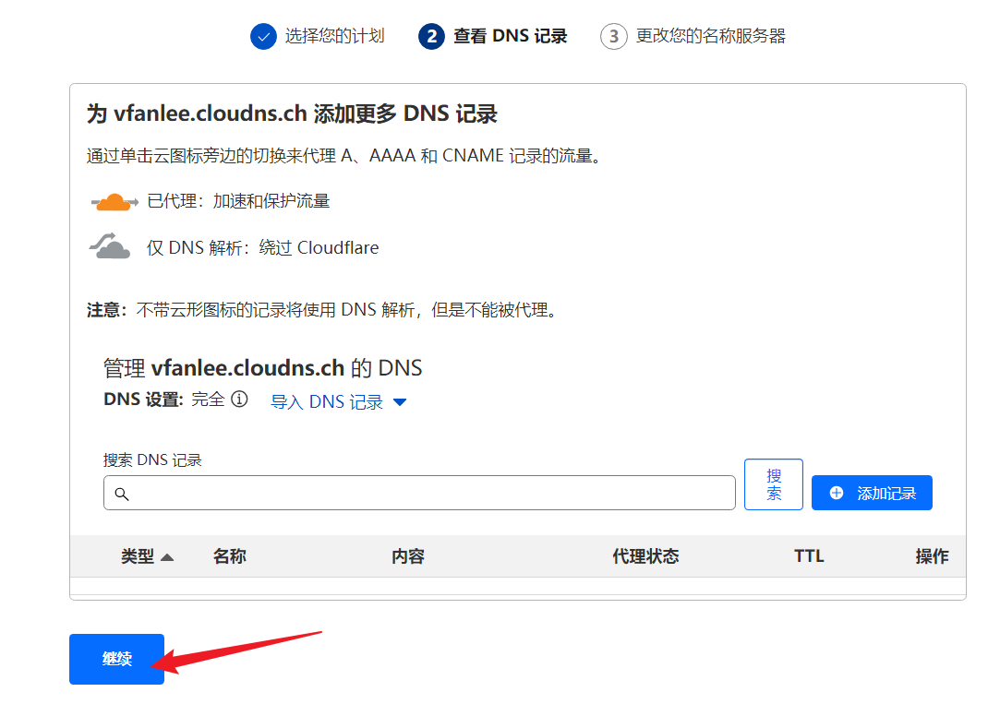
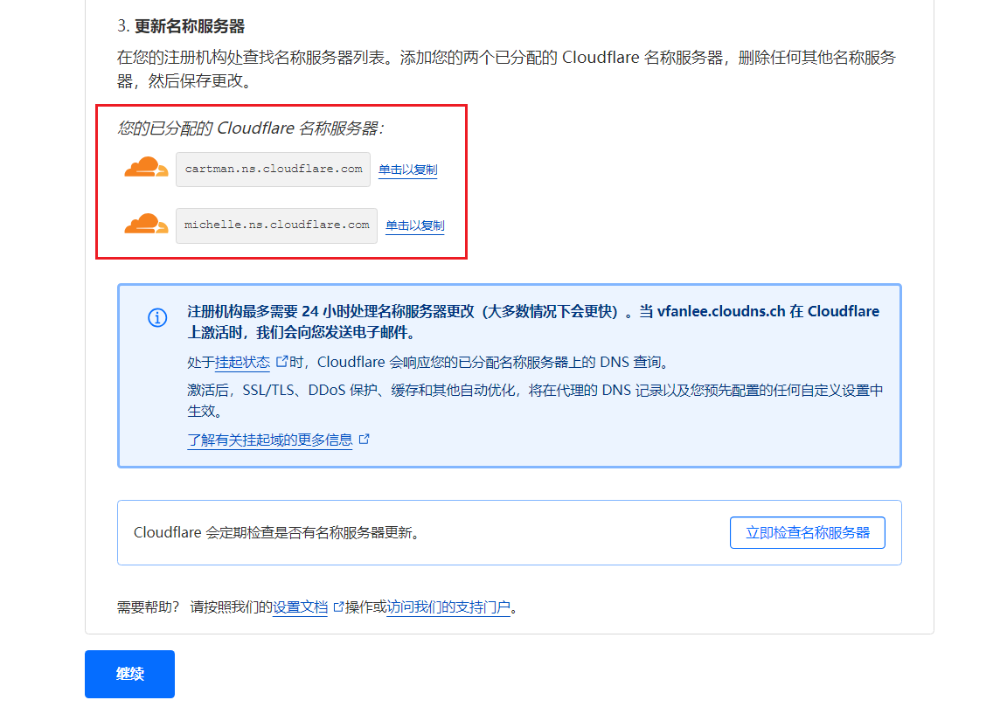
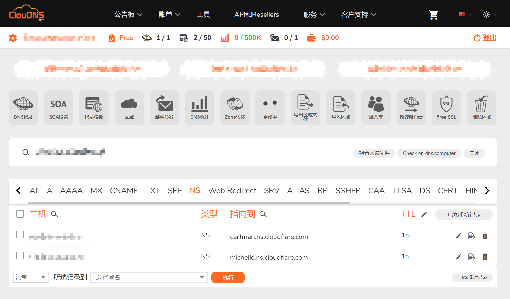
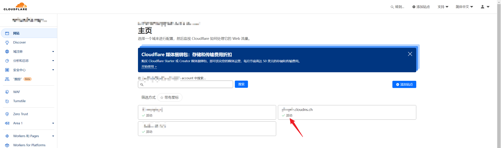

# DNS

## NS(Names Server) 名称服务器

我们可以将域名托管至 CF 来进行管理。

1. 在 CF **网站** 中 **添加站点**：

    

2. 输入托管域名：

   

3. 选择免费套餐即可：

    

4. 直接继续（DNS 记录以后可随时添加）

    

5. 记录 CF 分配的名称服务器，以便于后续使用

    

6. 删除原名称服务器，替换为 CF 的名称服务器：

    

7. 确定后，等待一段时间，当域名处于 **活动** 状态说明成功！

    
