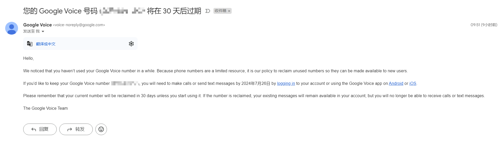

# Google Voice

当收到如下邮件时，需要在 30 天内拨打或者发送短信，以此来激活 Google Voice 的活跃度，不然将会回收账号。

PC 拨打电话保号：

  1. 电脑登录 [Google Voice](https://voice.google.com/)
  2. 拨打电话，如：微软客服：`+18006427676`。
  3. 等待接通即可。

Mobile 拨打电话保号：

  1. 手机下载 Google Voice 并登录。
  2. 进入设置，找到 *拨打和接听电话* 选项，切换至 *首选 WLAN 和移动数据网络*。
  
      默认是 *仅使用运营商服务*，需要绑定美国电话卡。
  
  3. 拨打电话，如：微软客服：`+18006427676`。
  4. 等待接通即可。

PC / Mobile 发送短信保号：

  1. 电脑登录 [Google Voice](https://voice.google.com/) / 手机登录。
  2. 给收过验证码的号码发送短信，内容随意。
  3. 短信发送成功即可。
