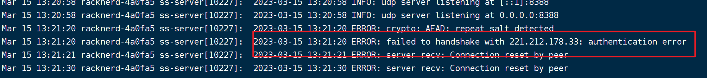
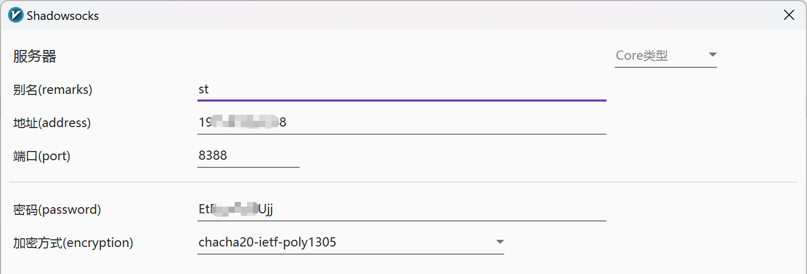
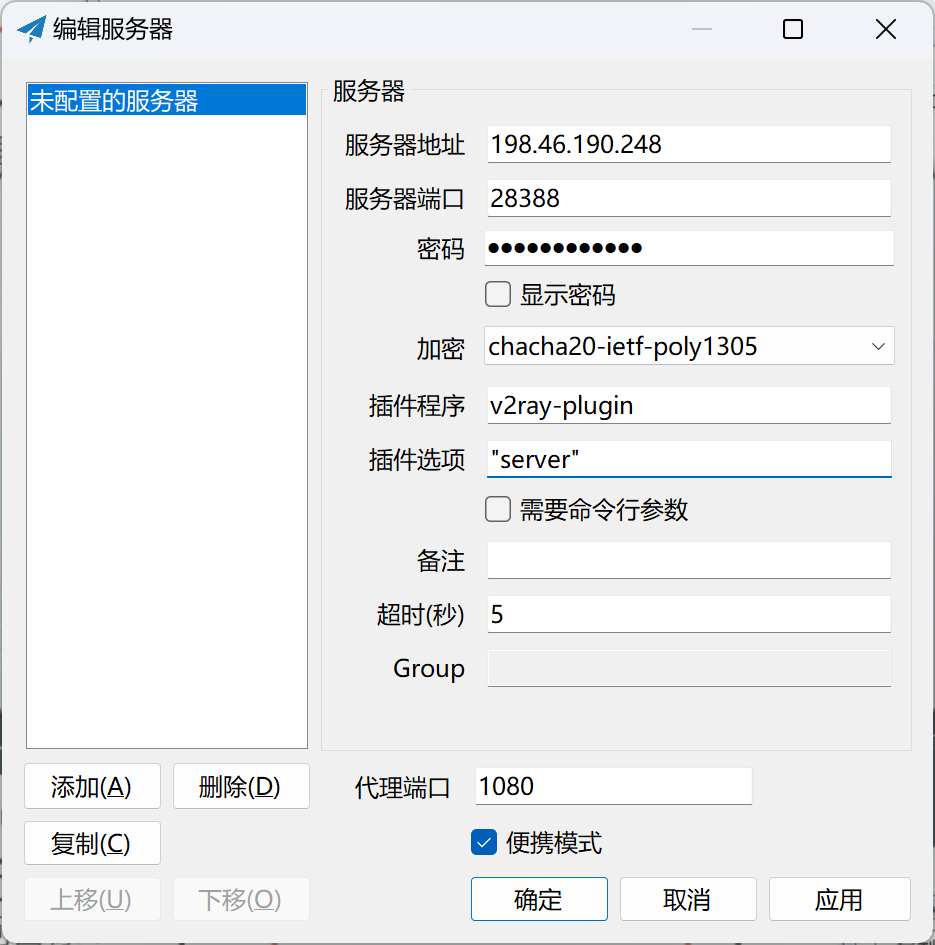

# shadowsocks 节点搭建

(shadowsocks-windows)支持插件的ss客户端 https://github.com/shadowsocks/shadowsocks-windows
(v2ray-plugin)shadowsocks插件：https://github.com/shadowsocks/v2ray-plugin
(v2rayN)方便测速但不支持ss插件：https://github.com/2dust/v2rayN

## shadowsocks

### 安装 shadowsocks

```sh
apt install shadowsocks-libev
```

### 查看 shadowsocks 状态

```sh
systemctl status shadowsocks-libev.service
```

### 编辑 shadowsocks 配置文件

```sh
vim /etc/shadowsocks-libev/config.json
```

配置如下：

```json
{
    "server":["::1", "0,0,0,0"], // 0,0,0,0 任意ip访问
    "mode":"tcp_and_udp",
    "server_port":8388, // 开放端口
    "local_port":1080,
    "password":"EtELzzED4Ujj", // 密码
    "timeout":86400,
    "method":"chacha20-ietf-poly1305" // 加密方式
}

```

### 重启 shadowsocks

systemctl restart shadowsocks-libev.service

### 服务器防火墙开放端口

```sh
ufw allow 8388
```

### 查看 shadowsocks 运行日志（调试）

```sh
journalctl -u shadowsocks-libev.service -f
```

**常见问题：**

1. 服务器防火墙已开放端口，代理访问时，调试日志无反应，说明防火墙在对服务器进行干扰，可尝试换个端口；
2. 防火墙“重放攻击”；
  

### v2rayN 添加ss服务器



### 安装 shadowsocks 插件

```sh
apt install shadowsocks-v2ray-plugin
vim /etc/shadowsocks-libev/config.json
```

配置参考：https://github.com/shadowsocks/v2ray-plugin#usage
```json
{
    "server":["::1", "0.0.0.0"],
    "mode":"tcp_and_udp",
    "server_port":8388,
    "local_port":1080,
    "password":"EtELzzED4Ujj",
    "timeout":86400,
    "method":"chacha20-ietf-poly1305",
    "plugin":"ss-v2ray-plugin",
    "plugin-opts":"server"
}
```

### 重启 shadowsocks 服务




# 

```
mv /var/lib/dpkg/info /var/lib/dpkg/info_silent
mkdir /var/lib/dpkg/info
apt update
apt -f install
mv /var/lib/dpkg/info/* /var/lib/dpkg/info_silent
rm -rf /var/lib/dpkg/info
mv /var/lib/dpkg/info_silent /var/lib/dpkg/info
```