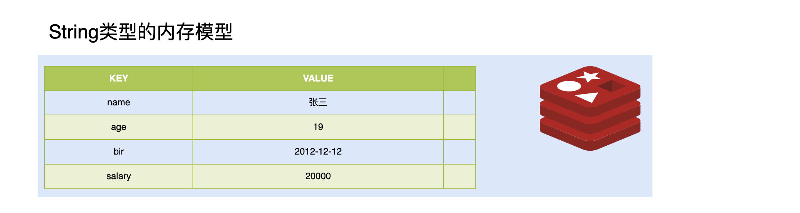
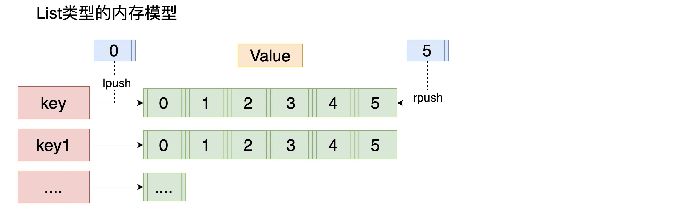
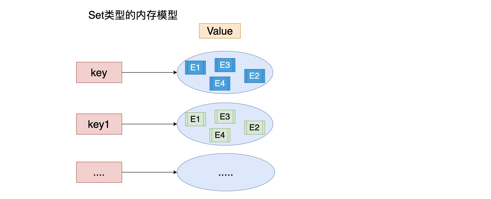
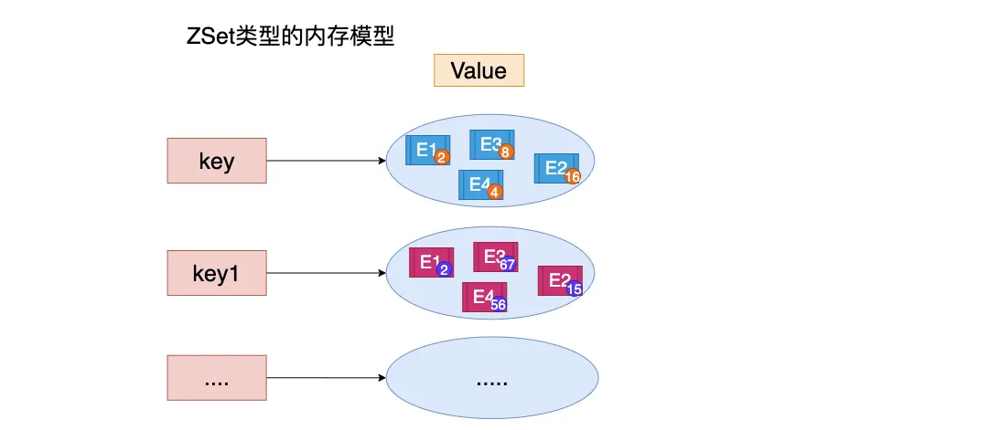
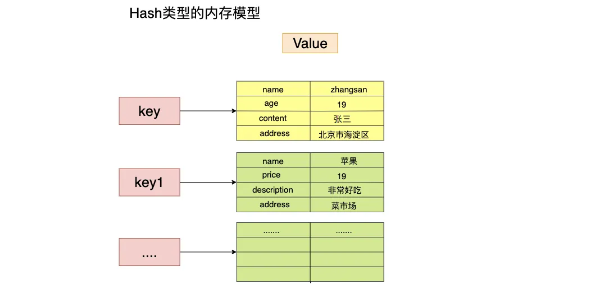

# 命令

## 数据库操作

### 选择数据库

使用 redis 的默认配置启动 redis 服务后，默认会存在 16 个库，编号从 0-15

```sh
# 根据编号选择一个 redis 的库
select index
```

### 清空当前的库

```sh
FLUSHDB
```

### 清空全部的库

```sh
FLUSHALL
```

## Key 操作

### 基本操作

- **`SET key value`**：设置指定键的值。
- **`GET key`**：获取指定键的值。
- **`DEL key [key ...]`**：删除一个或多个键。
- **`EXISTS key`**：检查键是否存在，存在返回 `1`，不存在返回 `0`。
- **`TYPE key`**：返回键的值类型（如字符串、列表、集合等）。

### 键的过期与生存时间

- **`EXPIRE key seconds`**：为键设置过期时间（以秒为单位），到期后键会被自动删除。
- **`EXPIREAT key timestamp`**：为键设置过期时间点（以 Unix 时间戳为单位）。
- **`TTL key`**：查看键的剩余生存时间（以秒为单位）。如果键没有设置过期时间，返回 `-1`；如果键不存在，返回 `-2`。
- **`PERSIST key`**：移除键的过期时间，使其成为永久键。

### 键的重命名

- **`RENAME key newkey`**：将键改名为 `newkey`，如果 `newkey` 已存在，则覆盖它。
- **`RENAMENX key newkey`**：当 `newkey` 不存在时，将键重命名为 `newkey`，否则操作无效。

### 键的遍历

- **`KEYS pattern`**：查找所有符合给定模式的键，模式可以包含通配符（如 `*`、`?`）。
- **`SCAN cursor [MATCH pattern] [COUNT count]`**：迭代数据库中的键，支持匹配模式和数量限制，适合大数据集的分批处理。

### 随机操作

- **`RANDOMKEY`**：随机返回一个键名，数据库为空时返回 `nil`。
- **`MOVE key db`**：将当前数据库中的键移动到指定数据库中。

### 键的序列化

- **`DUMP key`**：序列化键的值并返回被序列化的值。
- **`RESTORE key ttl serialized-value`**：将 `DUMP` 命令序列化后的值反序列化恢复为键，并设置生存时间。

## 五大类型操作

### String



| 命令          | 说明                                                                             |
| ------------- | -------------------------------------------------------------------------------- |
| `set`         | 设置一个 key/value                                                               |
| `get`         | 根据 key 获得对应的 value                                                        |
| `mset`        | 一次设置多个 key value                                                           |
| `mget`        | 一次获得多个 key 的 value                                                        |
| `getset`      | 获得原始 key 的值，同时设置新值                                                  |
| `strlen`      | 获得对应 key 存储 value 的长度                                                   |
| `append`      | 为对应 key 的 value 追加内容                                                     |
| `getrange`    | 索引 0 开始 截取 value 的内容                                                    |
| `setex`       | 设置一个 key 存活的有效期（秒）                                                  |
| `psetex`      | 设置一个 key 存活的有效期（毫秒）                                                |
| `setnx`       | 存在不做任何操作,不存在添加                                                      |
| `msetnx`      | 原子操作(只要有一个存在不做任何操作) 可以同时设置多个 key,只有有一个存在都不保存 |
| `decr`        | 进行数值类型的-1 操作                                                            |
| `decrby`      | 根据提供的数据进行减法操作                                                       |
| `incr`        | 进行数值类型的+1 操作                                                            |
| `incrby`      | 根据提供的数据进行加法操作                                                       |
| `incrbyfloat` | 根据提供的数据加入浮点数                                                         |

### List

特点：元素有序，可以重复



| 命令      | 说明                                            |
| --------- | ----------------------------------------------- |
| `lpush`   | 将某个值加入到一个 key 列表头部                 |
| `lpushx`  | 同 lpush,但是必须要保证这个 key 存在            |
| `rpush`   | 将某个值加入到一个 key 列表末尾                 |
| `rpushx`  | 同 rpush,但是必须要保证这个 key 存在            |
| `lpop`    | 返回和移除列表左边的第一个元素                  |
| `rpop`    | 返回和移除列表右边的第一个元素                  |
| `lrange`  | 获取某一个下标区间内的元素（0 -1 遍历整个列表） |
| `llen`    | 获取列表元素个数                                |
| `lset`    | 设置某一个指定索引的值(索引必须存在)            |
| `lindex`  | 获取某一个指定索引位置的元素                    |
| `lrem`    | 删除重复元素                                    |
| `ltrim`   | 保留列表中特定区间内的元素                      |
| `linsert` | 在某一个元素之前，之后插入新元素                |

### Set

特点：元素无序，不可重复



| 命令          | 说明                                                 |
| ------------- | ---------------------------------------------------- |
| `sadd`        | 为集合添加元素                                       |
| `smembers`    | 显示集合中所有元素 无序                              |
| `scard`       | 返回集合中元素的个数                                 |
| `spop`        | 随机返回一个元素 并将元素在集合中删除                |
| `smove`       | 从一个集合中向另一个集合移动元素 必须是同一种类型    |
| `srem`        | 从集合中删除一个元素                                 |
| `sismember`   | 判断一个集合中是否含有这个元素                       |
| `srandmember` | 随机返回元素                                         |
| `sdiff`       | 返回去掉第一个集合 与 其它集合中含有的相同元素的集合 |
| `sinter`      | 求交集                                               |
| `sunion`      | 求和集                                               |

### ZSet

特点：可排序，不可重复



| 命令            | 说明                                     |
| --------------- | ---------------------------------------- |
| `zadd`          | 添加一个有序集合元素                     |
| `zcard`         | 返回集合的元素个数                       |
| `zrange`        | 升序 zrevrange 降序 返回一个范围内的元素 |
| `zrangebyscore` | 按照分数查找一个范围内的元素             |
| `zrank`         | 返回排名                                 |
| `zrevrank`      | 倒序排名                                 |
| `zscore`        | 显示某一个元素的分数                     |
| `zrem`          | 移除某一个元素                           |
| `zincrby`       | 给某个特定元素加分                       |

### Hash

特点：map 结构，存在 key/value，key 无序的



| 命令           | 说明                                           |
| -------------- | ---------------------------------------------- |
| `hset`         | 设置一个 key/value 对（Redis6.0 可以设置多个） |
| `hget`         | 获得一个 key 对应的 value                      |
| `hgetall`      | 获得所有的 key/value 对                        |
| `hdel`         | 删除某一个 key/value 对                        |
| `hexists`      | 判断一个 key 是否存在                          |
| `hkeys`        | 获得所有的 key                                 |
| `hvals`        | 获得所有的 value                               |
| `hmset`        | 设置多个 key/value                             |
| `hmget`        | 获得多个 key 的 value                          |
| `hsetnx`       | 设置一个不存在的 key 的值                      |
| `hincrby`      | 为 value 进行加法运算                          |
| `hincrbyfloat` | 为 value 加入浮点值                            |
