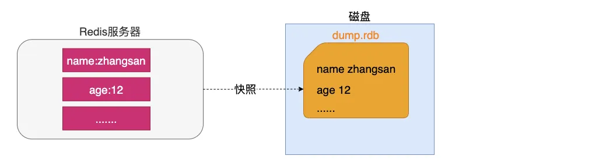
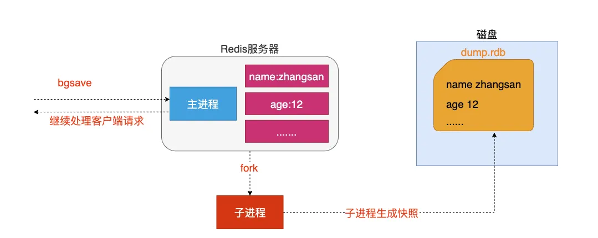
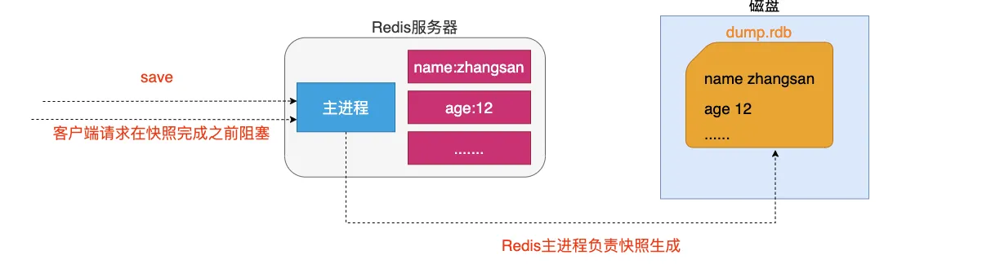
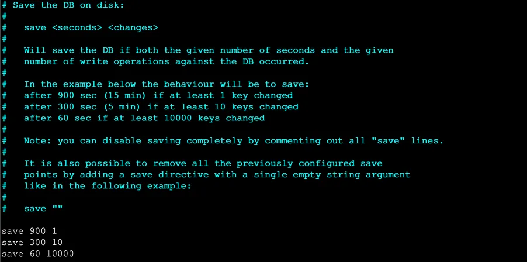
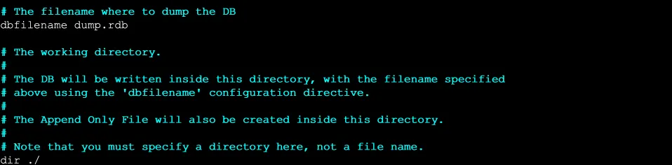
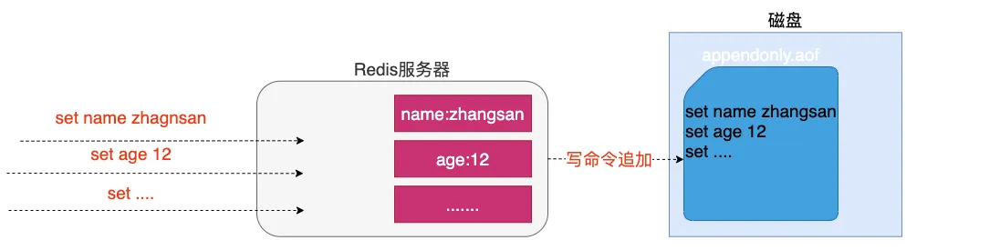
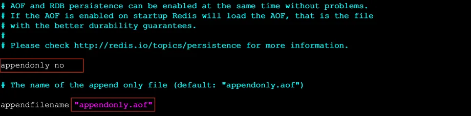
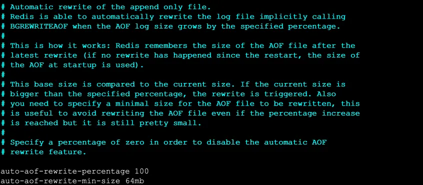
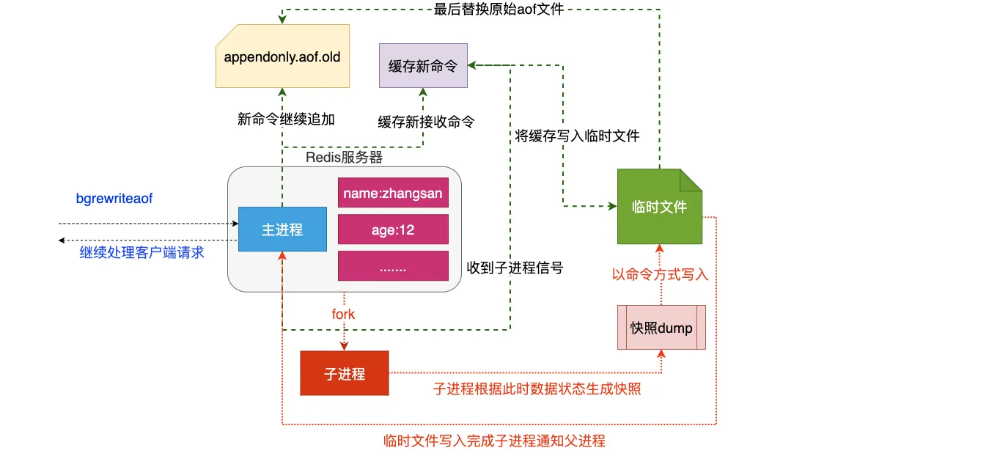

# 持久化

**持久化机制：内存数据 -> 磁盘**

Redis 官方提供了两种不同的持久化方法来将数据存储到硬盘里面，分别是:

1. Snapshot 快照 / RDB
2. AOF(Append Only File) 只追加日志文件

## Snapshot

### 特点

这种方式可以将某一时刻的所有数据都写入硬盘中，这也是 redis 的 **默认** 持久化方式，保存为 `.rdb`  结尾的文件，因此这种方式也称之为 **RDB 方式**。

### 快照生成方式

- 客户端方式: BGSAVE 和 SAVE
- 服务器配置自动触发

#### 客户端方式 - BGSAVE 命令

- 客户端可以使用 BGSAVE 命令来创建一个快照，当接收到客户端的 BGSAVE 命令时，redis 会调用 `fork` 来创建一个子进程，然后子进程负责将快照写入磁盘中，而父进程则继续处理命令请求。

::: tip fork 解释
当一个进程创建子进程的时候，底层的操作系统会创建该进程的一个副本，在类 unix 系统中创建子进程的操作会进行优化：在刚开始的时候，父子进程共享相同内存，直到父进程或子进程对内存进行了写之后，对被写入的内存的共享才会结束服务
:::

#### 客户端方式 - SAVE 命令

客户端还可以使用 SAVE 命令来创建一个快照，接收到 SAVE 命令的 redis 服务器在快照创建完毕之前将不再响应任何其他的命令。

::: warning
SAVE 命令并不常用，使用 SAVE 命令在快照创建完毕之前，redis 处于阻塞状态，无法对外服务
:::

#### 服务器配置方式之满足配置自动触发

如果用户在 `redis.conf` 中设置了 save 配置选项，redis 会在 save 选项条件满足之后自动触发一次 BGSAVE 命令，如果设置多个 save 配置选项，当任意一个 save 配置选项条件满足，redis 也会触发一次 BGSAVE 命令

#### 服务器接收客户端 shutdown 指令

当 redis 通过 shutdown 指令接收到关闭服务器的请求时，会执行一个 save 命令，阻塞所有的客户端，不再执行客户端执行发送的任何命令，并且在 save 命令执行完毕之后关闭服务器

### 配置生成快照名称和位置

::: info 说明

- `dbfilename dump.rdb`：生成快照名称
- `dir ./`：生成位置
  :::

## AOF

### 特点

这种方式可以将所有客户端执行的写命令记录到日志文件中，AOF 持久化会将被执行的写命令写到 AOF 的文件末尾，以此来记录数据发生的变化，因此只要 redis 从头到尾执行一次 AOF 文件所包含的所有写命令，就可以恢复 AOF 文件的记录的数据集。

### 开启 AOF 持久化

在 redis 的默认配置中 AOF 持久化机制是没有开启的，需要在配置中开启：

::: info 说明

- `appendonly yes`：开启持久化
- `appendfilename "appendonly.aof"`：指定生成文件名称
  :::

### 修改同步频率

::: details 日志追加频率

1. **always** 【谨慎使用】

   - 说明: 每个 redis 写命令都要同步写入硬盘，严重降低 redis 速度
   - 解释: 如果用户使用了 always 选项，那么每个 redis 写命令都会被写入硬盘，从而将发生系统崩溃时出现的数据丢失减到最少;遗憾的是，因为这种同步策略需要对硬盘进行大量的写入操作，所以 redis 处理命令的速度会受到硬盘性能的限制;
   - 注意: 转盘式硬盘在这种频率下 200 左右个命令/s ; 固态硬盘(SSD) 几百万个命令/s;
   - 警告: 使用 SSD 用户请谨慎使用 always 选项，这种模式不断写入少量数据的做法有可能会引发严重的写入放大问题，导致将固态硬盘的寿命从原来的几年降低为几个月。

2. **everysec** 【推荐】

   - 说明: 每秒执行一次同步显式的将多个写命令同步到磁盘
   - 解释： 为了兼顾数据安全和写入性能，用户可以考虑使用 everysec 选项，让 redis 每秒一次的频率对 AOF 文件进行同步;redis 每秒同步一次 AOF 文件时性能和不使用任何持久化特性时的性能相差无几，而通过每秒同步一次 AOF 文件，redis 可以保证，即使系统崩溃，用户最多丢失一秒之内产生的数据。

3. **no** 【不推荐】

   - 说明: 由操作系统决定何时同步
   - 解释：最后使用 no 选项，将完全有操作系统决定什么时候同步 AOF 日志文件，这个选项不会对 redis 性能带来影响但是系统崩溃时，会丢失不定数量的数据，另外如果用户硬盘处理写入操作不够快的话，当缓冲区被等待写入硬盘数据填满时，redis 会处于阻塞状态，并导致 redis 的处理命令请求的速度变慢。

:::

::: info 说明

- `appendfsync [everysec|always|no]`：指定同步频率
:::

### AOF 文件的重写

AOF 的方式也同时带来了另一个问题。持久化文件会变的越来越大。例如我们调用 `incr test` 命令 100 次，文件中必须保存全部的 100 条命令，其实有 99 条都是多余的。因为要恢复数据库的状态其实文件中保存一条 `set test 100` 就够了。为了压缩 aof 的持久化文件 Redis 提供了 AOF 重写(ReWriter)机制。

AOF 重写机制用来在一定程度上减小 AOF 文件的体积。

**重写方式通常有两种**：

- 客户端方式触发重写
- 服务器配置方式自动触发

::: warning
重写 aof 文件的操作，并没有读取旧的 aof 文件，而是将整个内存中的数据库内容用命令的方式重写了一个新的 aof 文件，替换原有的文件这点和快照有点类似。
:::

#### 客户端方式触发重写

执行 `BGREWRITEAOF` 命令，不会阻塞 redis 的服务。

#### 服务器配置方式自动触发

1. 配置 `redis.conf` 中的 `auto-aof-rewrite-percentage` 选项
2. 如果设置 `auto-aof-rewrite-percentage` 值为 100 和 `auto-aof-rewrite-min-size 64mb`，并且启用的 AOF 持久化时，那么当 AOF 文件体积大于 64M，并且 AOF 文件的体积比上一次重写之后体积大了至少一倍(100%)时，会自动触发，如果重写过于频繁，用户可以考虑将 `auto-aof-rewrite-percentage` 设置为更大

#### 重写流程

1. redis 调用 fork ，现在有父子两个进程 子进程根据内存中的数据库快照，往临时文件中写入重建数据库状态的命令
2. 父进程继续处理 client 请求，除了把写命令写入到原来的 aof 文件中。同时把收到的写命令缓存起来。这样就能保证如果子进程重写失败的话并不会出问题。
3. 当子进程把快照内容写入已命令方式写到临时文件中后，子进程发信号通知父进程。然后父进程把缓存的写命令也写入到临时文件。
4. 现在父进程可以使用临时文件替换老的 aof 文件，并重命名，后面收到的写命令也开始往新的 aof 文件中追加。

## 持久化总结

两种持久化方案既可以同时使用，又可以单独使用，在某种情况下也可以都不使用，具体使用那种持久化方案取决于用户的数据和应用决定。

无论使用 AOF 还是快照机制持久化，将数据持久化到硬盘都是有必要的，除了持久化外，用户还应该对持久化的文件进行备份(最好备份在多个不同地方)。
