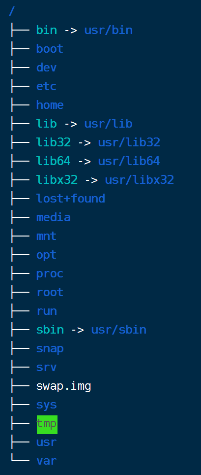

# 系统

## 系统目录介绍



- **系统启动必须**
  - `/boot/`：系统引导程序加载所需文件。
  - `/etc/`：系统管理所需的配置文件。
  - `/lib/`：系统共享库。
  - `/sys/`：系统内核文件。

- **指令集合**
  - `/bin/`：可执行命令。
  - `/sbin/`：类似于 `/bin/`，存放系统管理员使用的执行命令。

- **外部文件管理**
  - `/dev/`：设备文件。
  - `/media/`：可移动媒体（CD、usb）文件挂载点。
  - `/mnt/`：临时挂载点。

- **临时文件**
  - `/run/`：临时文件系统，存储系统启动以来的信息，系统重启后，该目录下的原文件被清除。
  - `/lost+found/`：系统崩溃后存储损坏文件的地方。
  - `/tmp/`：临时存储文件夹，存储在该目录下的文件在下次开机后被清除。

- **用户管理**
  - `/root/`：root 用户主目录。
  - `/home/`：个人用户主目录，每个用户都有一个自己的目录，以用户名命名。
  - `/usr/`：共享资源目录（unix shared resources），用户很多程序和文件都存储在该目录下。

- **运行所需**
  - `/proc/`：伪文件系统。系统关闭时会消失，系统启动时会创建的目录，在该目录下，每个活动进程都有一个专门的目录来进行管理。
  - `/var/`：存放经常修改的数据，比如程序运行的日志文件 `/var/log`。

- **拓展**
  - `/opt/`：很少使用，通常是软件供应商放置可选软件包的地方。
  - `/srv/`：存放一些服务启动之后需要提取的数据。

## 查看操作系统版本

```sh
sudo lsb_release -a
```
