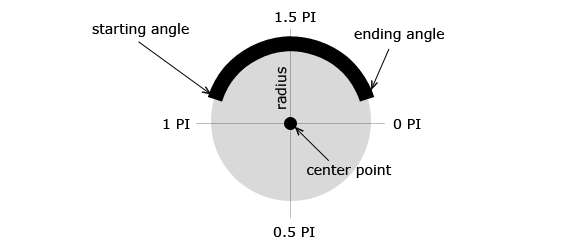
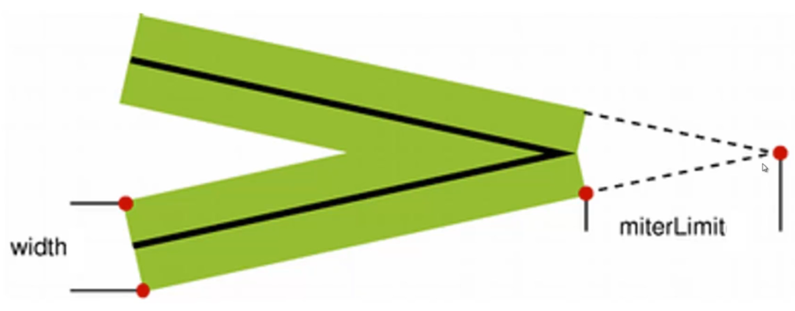

# Canvas

> - [Canvas API](https://developer.mozilla.org/zh-CN/docs/Web/API/Canvas_API)
> - [CanvasRenderingContext2D](https://developer.mozilla.org/zh-CN/docs/Web/API/CanvasRenderingContext2D)

## Canvas 基础

canvas 是 inline 盒。

```html
<canvas id="canvas"></canvas>
```

canvas 所有核心接口都在 canvas 的绘制上下文中。

```js
/**
 * @type {HTMLCanvasElement}
 */
const canvas = document.getElementById('canvasId')
canvas.width = 300 // canvas 宽度，以 CSS 像素（px）表示，默认 300
canvas.height = 300 // canvas 宽度，以 CSS 像素（px）表示，默认 150
const ctx = canvas.getContext('2d') // 2d 绘图
```

## 直线

- [beginPath()](https://developer.mozilla.org/zh-CN/docs/Web/API/CanvasRenderingContext2D/beginPath)：`beginPath` 会清空子路径列表开始一个新路径。
- [moveTo(x, y)](https://developer.mozilla.org/zh-CN/docs/Web/API/CanvasRenderingContext2D/moveTo)：将一个新的子路径的起始点移动到 (x，y) 坐标。
- [lineTo(x, y)](https://developer.mozilla.org/zh-CN/docs/Web/API/CanvasRenderingContext2D/lineTo)：使用直线连接子路径的终点到 (x, y) 坐标。
- [closePath()](https://developer.mozilla.org/zh-CN/docs/Web/API/CanvasRenderingContext2D/closePath)：笔点返回到当前子路径起始点的方法。

### 绘制矩形的简易 API

实际上，掌握了直线的绘制即掌握了矩形的绘制，但是为了更方便，官方也提供了绘制矩形的简易 API。

- [rect(x, y, width, height)](https://developer.mozilla.org/zh-CN/docs/Web/API/CanvasRenderingContext2D/rect)
- [strokeRect(x, y, width, height)](https://developer.mozilla.org/zh-CN/docs/Web/API/CanvasRenderingContext2D/strokeRect)
- [fillRect(x, y, width, height)](https://developer.mozilla.org/zh-CN/docs/Web/API/CanvasRenderingContext2D/fillRect)

## 曲线

- [arc(x, y, radius, startAngle, endAngle[, counterclockwise])](https://developer.mozilla.org/zh-CN/docs/Web/API/CanvasRenderingContext2D/arc)：圆弧路径的圆心在 (x, y) 位置，半径为 r，根据 counterclockwise （默认为顺时针）指定的方向从 startAngle 开始绘制，到 endAngle 结束。  

- [arcTo(x1, y1, x2, y2, radius)](https://developer.mozilla.org/zh-CN/docs/Web/API/CanvasRenderingContext2D/arcTo)：根据当前描点与给定的控制点 1 连接的直线，和控制点 1 与控制点 2 连接的直线，作为使用指定半径的圆的切线，画出两条切线之间的弧线路径。
- [quadraticCurveTo(cpx, cpy, x, y)](https://developer.mozilla.org/zh-CN/docs/Web/API/CanvasRenderingContext2D/quadraticCurveTo)：二次贝塞尔曲线，可通过 [可视化示例](https://tinyurl.com/html5quadratic) 帮助理解。
- [bezierCurveTo(cp1x, cp1y, cp2x, cp2y, x, y)](https://developer.mozilla.org/zh-CN/docs/Web/API/CanvasRenderingContext2D/bezierCurveTo)：三次贝塞尔曲线。可通过 [可视化示例](https://tinyurl.com/html5bezier) 帮助理解。
- [ellipse(x, y, radiusX, radiusY, rotation, startAngle, endAngle[, counterclockwise])](https://developer.mozilla.org/zh-CN/docs/Web/API/CanvasRenderingContext2D/ellipse)：椭圆的圆心在（x,y）位置，半径分别是 radiusX 和 radiusY，按照 anticlockwise（默认顺时针）指定的方向，从 startAngle 开始绘制，到 endAngle 结束。

## 动作

### 绘制动作

- [stroke()](https://developer.mozilla.org/zh-CN/docs/Web/API/CanvasRenderingContext2D/stroke)：画线绘制。
- [stroke([path])](https://developer.mozilla.org/zh-CN/docs/Web/API/CanvasRenderingContext2D/stroke)：根据 [Path2D](https://developer.mozilla.org/zh-CN/docs/Web/API/Path2D) 画线绘制。
- [fill([fillRule])](https://developer.mozilla.org/zh-CN/docs/Web/API/CanvasRenderingContext2D/fill)：填充样式，默认规则为 nonzero。
- [fill(path[, fillRule])](https://developer.mozilla.org/zh-CN/docs/Web/API/CanvasRenderingContext2D/fill)：根据 [Path2D](https://developer.mozilla.org/zh-CN/docs/Web/API/Path2D) 填充样式。

### stroke 样式

- [strokeStyle](https://developer.mozilla.org/zh-CN/docs/Web/API/CanvasRenderingContext2D/strokeStyle)：指定绘制线条的样式，可取值：[color](https://developer.mozilla.org/zh-CN/docs/Web/CSS/color_value)、[gradient](https://developer.mozilla.org/zh-CN/docs/Web/API/CanvasGradient)、[pattern](https://developer.mozilla.org/zh-CN/docs/Web/API/CanvasPattern)。
- [lineWidth](https://developer.mozilla.org/zh-CN/docs/Web/API/CanvasRenderingContext2D/lineWidth)：指定线宽。
- [lineCap](https://developer.mozilla.org/zh-CN/docs/Web/API/CanvasRenderingContext2D/lineCap)：指定绘制线条两头的形状，可取值：butt（默认值）、round、square。
- [lineJoin](https://developer.mozilla.org/zh-CN/docs/Web/API/CanvasRenderingContext2D/lineJoin)：指定绘制线条之间的交叉形状，可取值：miter（默认值）、bevel、round。
- [miterLimit](https://developer.mozilla.org/zh-CN/docs/Web/API/CanvasRenderingContext2D/miterLimit)：需配合 `lineJoin = miter` 来使用。  


### fill 样式

- [fillStyle](https://developer.mozilla.org/zh-CN/docs/Web/API/CanvasRenderingContext2D/fillStyle)：指定绘制填充样式，可取值：[color](https://developer.mozilla.org/zh-CN/docs/Web/CSS/color_value)、[gradient](https://developer.mozilla.org/zh-CN/docs/Web/API/CanvasGradient)、[pattern](https://developer.mozilla.org/zh-CN/docs/Web/API/CanvasPattern)。

## 状态保存

- [save()](https://developer.mozilla.org/zh-CN/docs/Web/API/CanvasRenderingContext2D/save)
- [restore()](https://developer.mozilla.org/zh-CN/docs/Web/API/CanvasRenderingContext2D/restore)

## 图形变换

- [translate(x, y)](https://developer.mozilla.org/zh-CN/docs/Web/API/CanvasRenderingContext2D/translate)
- [rotate(angle)](https://developer.mozilla.org/zh-CN/docs/Web/API/CanvasRenderingContext2D/rotate)
- [scale(x, y)](https://developer.mozilla.org/zh-CN/docs/Web/API/CanvasRenderingContext2D/scale)
- [transform(a, b, c, d, e, f)](https://developer.mozilla.org/zh-CN/docs/Web/API/CanvasRenderingContext2D/transform)
- [setTransform(a, b, c, d, e, f)](https://developer.mozilla.org/zh-CN/docs/Web/API/CanvasRenderingContext2D/setTransform)

## 阴影

- [shadowColor](https://developer.mozilla.org/zh-CN/docs/Web/API/CanvasRenderingContext2D/shadowColor)
- [shadowOffsetX](https://developer.mozilla.org/zh-CN/docs/Web/API/CanvasRenderingContext2D/shadowOffsetX)
- [shadowOffsetY](https://developer.mozilla.org/zh-CN/docs/Web/API/CanvasRenderingContext2D/shadowOffsetY)
- [shadowBlur](https://developer.mozilla.org/zh-CN/docs/Web/API/CanvasRenderingContext2D/shadowBlur)

## 透明度

- [globalAlpha](https://developer.mozilla.org/zh-CN/docs/Web/API/CanvasRenderingContext2D/globalAlpha)

## 遮挡效果

- [globalCompositeOperation](https://developer.mozilla.org/zh-CN/docs/Web/API/CanvasRenderingContext2D/globalCompositeOperation)

## 剪切

- [clip](https://developer.mozilla.org/zh-CN/docs/Web/API/CanvasRenderingContext2D/clip)

## 清空区域

- [clearRect(x, y, width, height)](https://developer.mozilla.org/zh-CN/docs/Web/API/CanvasRenderingContext2D/clearRect)

## 文字

- [font](https://developer.mozilla.org/zh-CN/docs/Web/API/CanvasRenderingContext2D/font)：同 [css font](https://developer.mozilla.org/zh-CN/docs/Web/CSS/font)。
- [textAlign](https://developer.mozilla.org/zh-CN/docs/Web/API/CanvasRenderingContext2D/textAlign)：文本的对齐方式。
- [textBaseLine](https://developer.mozilla.org/zh-CN/docs/Web/API/CanvasRenderingContext2D/textBaseLine)：文本基线对齐方式。
- [strokeText(string, x, y [, maxlen])](https://developer.mozilla.org/zh-CN/docs/Web/API/CanvasRenderingContext2D/strokeText)：绘制文字轮廓。
- [fillText(string, x, y [, maxlen])](https://developer.mozilla.org/zh-CN/docs/Web/API/CanvasRenderingContext2D/fillText)：填充文本。
- [measureText(string)](https://developer.mozilla.org/zh-CN/docs/Web/API/CanvasRenderingContext2D/measureText)：返回 [TextMetrics](https://developer.mozilla.org/zh-CN/docs/Web/API/TextMetrics) 对象。

## 图片

[drawImage()](https://developer.mozilla.org/zh-CN/docs/Web/API/CanvasRenderingContext2D/drawImage)

- `drawImage(image, dx, dy)`
- `drawImage(image, dx, dy, dWidth, dHeight)`
- `drawImage(image, sx, sy, sWidth, sHeight, dx, dy, dWidth, dHeight)`

```js
const image = new Image()
image.src = 'https://picsum.photos/200/300'
image.onload = function() {
  // ctx.drawImage(...)
}
```

## 绘制虚线

[setLineDash](https://developer.mozilla.org/zh-CN/docs/Web/API/CanvasRenderingContext2D/setLineDash)

## 检测是否在路径内

[isPointInPath(x, y)](https://developer.mozilla.org/zh-CN/docs/Web/API/CanvasRenderingContext2D/isPointInPath)

## 拓展：那些有意思的 canvas 库

- [roughjs](https://roughjs.com/)：手绘图形。
