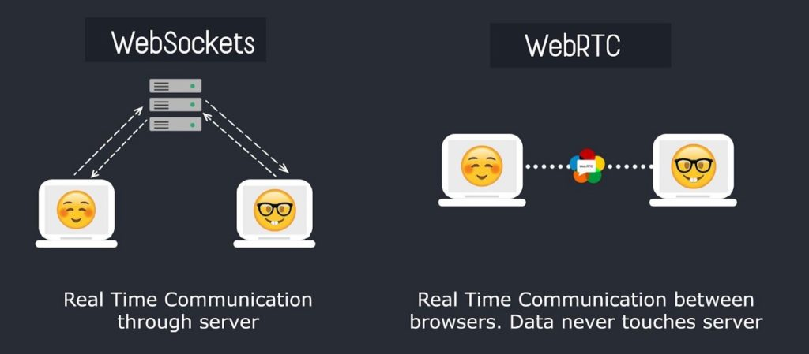

# 信令服务器

## WebSocket vs WebRTC

在介绍信令服务器是什么之前，先看看 WebScoket 与 WebRTC 工作流程的，一图胜千言：

根据上图关于工作流程的简单介绍，一定会有个疑问，**这俩客户端是怎么建立连接的？** 没错，有了这个疑问便是知道了信令服务器的主要作用。

## 介绍

信令服务器是 WebRTC 中用于交换控制信息的服务器，其主要作用是帮助通信双方建立连接，但不参与实际的数据传输。

WebRTC 连接过程的步骤中，通信双方需要交换一些必要的信息，比如：

1. **SDP (Session Description Protocol)**：用于描述媒体的格式、编解码器、网络信息等。
2. **ICE (Interactive Connectivity Establishment) 候选**：帮助找到可以用来传输数据的网络路径，包括公网、私网地址等。

信令服务器的主要作用：

1. **交换 SDP 信息**：在开始连接时，双方需要通过信令服务器发送和接收 SDP 提供的媒体信息。
2. **交换 ICE 候选**：通信双方通过信令服务器交换各自的候选网络路径，来确定最佳的通信路径。
3. **网络穿透**：在 NAT 和防火墙的情况下，信令服务器辅助通信双方打洞（NAT traversal），以找到可以互相通信的 IP 地址和端口。
4. **管理会话**：信令服务器还负责管理通信会话的生命周期，例如发起、终止会话或传递消息通知。

需要注意的是，信令服务器仅用于连接建立过程中的信息交换，实际的音视频数据通过点对点（P2P）直接传输，不经过信令服务器。

常见的信令协议包括 WebSockets、SIP (Session Initiation Protocol) 等。

## 一对一信令逻辑

客户端信令消息：

- join 加入房间
- leave 离开房间
- message 端对端消息
  - Offer 消息
  - Answer 消息
  - Candidate 消息

服务器端信令消息：

- joined 已加入房间
- otherjoin 其他用户加入房间
- full 房间人数已满
- leaved 已离开房间
- bye 对方离开房间
