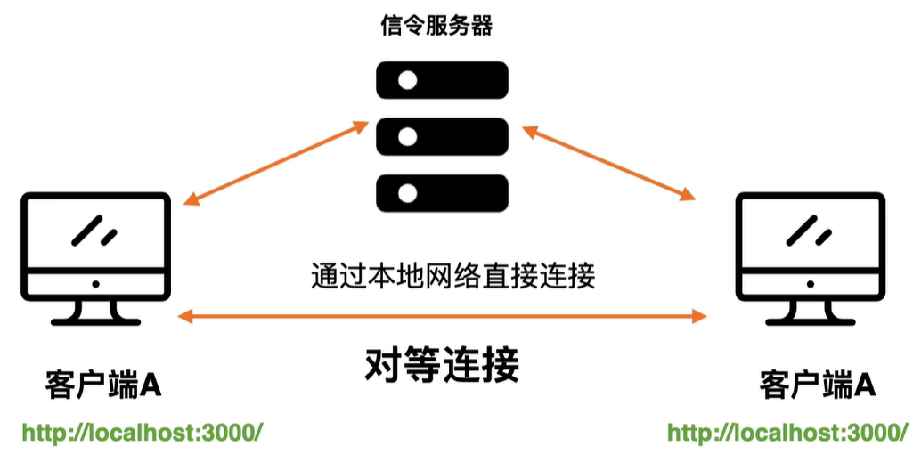
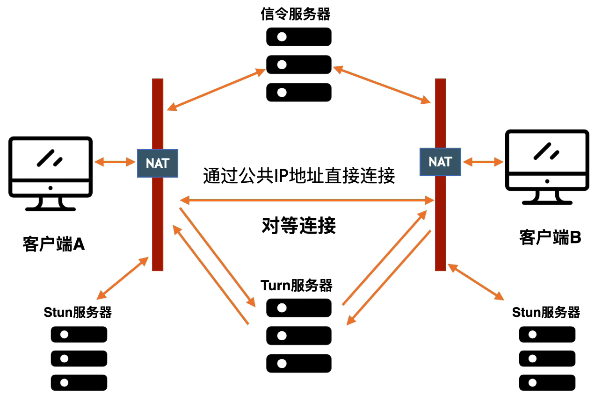
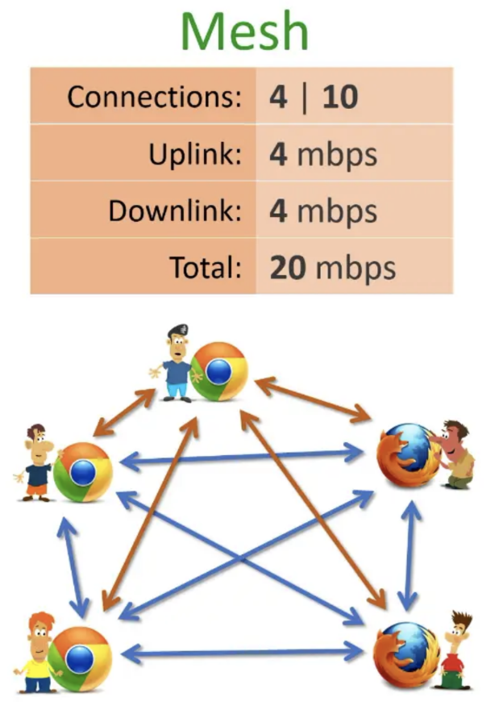
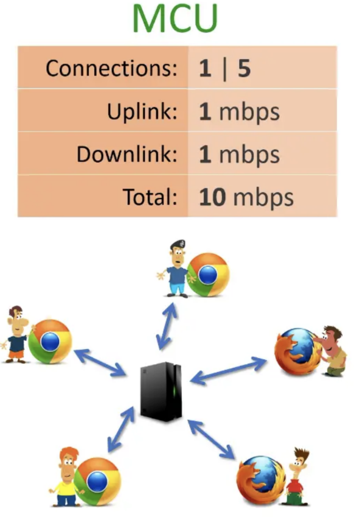
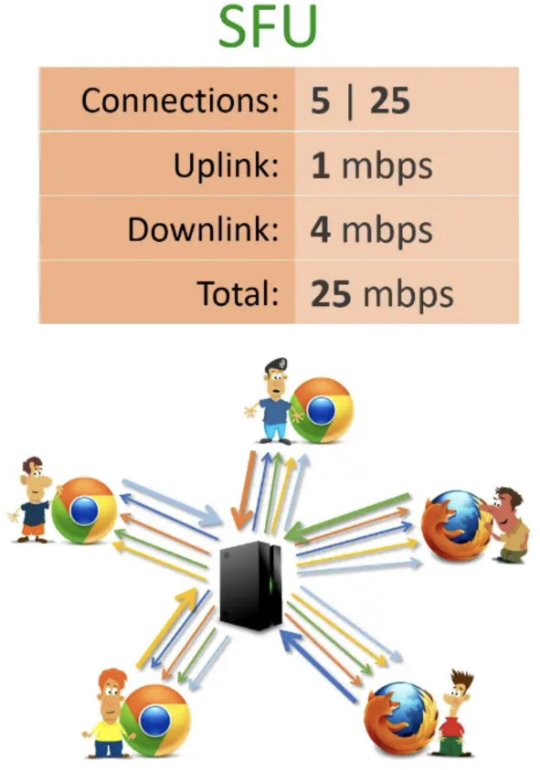
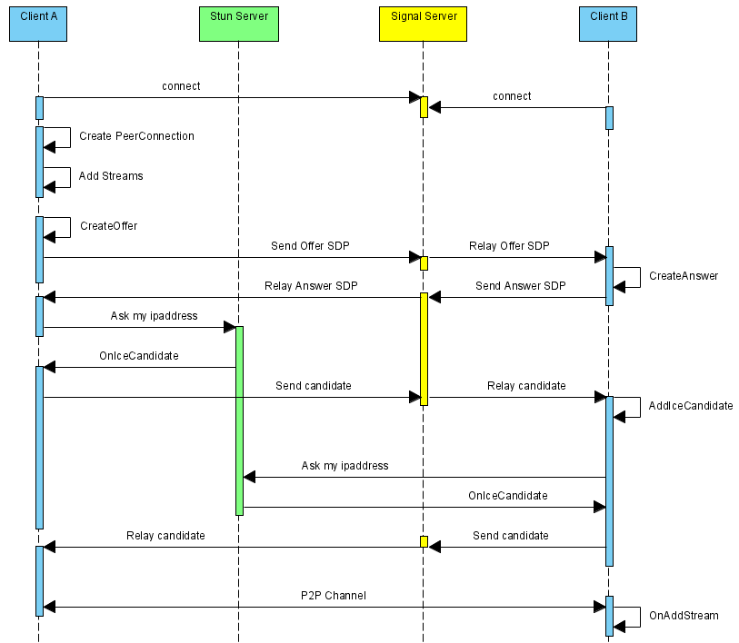

# WebRTC 工作流程

## 对等连接

### 通过本地网络直接连接

如果两个设备都在本地网络上，则无需做任何特别的工作即可使用对等连接彼此，就是一台设备具有另一台设备的本地 IP 地址，则它们可以直接相互通信。

### 通过公共 IP 地址 Internet 直接连接

当设备不在同一个本地网络中时只能通过公共 IP 地址来实现相互访问的方式，但是由于我们的设备不知道公共 IP 地址，因此就需要使用 STUN 服务器，用于帮助客户端之间找到对方。

当客户端之间通过 STUN 服务器连接失败时，可以通过 TURN 服务器进行转接。

Turn 可以转发两个端点的音视频数据(不是信令数据)，因为 Turn 服务器是在公网上，所以他能被各个客户端找到，另外 Turn 服务器转发的是数据流，很占用带宽和资源。

## 多方通信

### Mesh 架构

即：每个端都与其它端互连。

以上图为例，5个浏览器，一一建立p2p连接，每个浏览器与其它 4 个建立连接，总共需要 10 个连接。如果每条连接占用 1m 带宽，则每个端上行需要 4m，下行带宽也要 4m，总共带宽消耗 20m。而且除了带宽问题，每个浏览器上还要有音视频“编码/解码”，cpu 使用率也是问题，一般这种架构只能支持 4-6 人左右，不过优点也很明显，没有中心节点，实现很简单。

### MCU (MultiPoint Control Unit) 架构

以上图为例，这是一种传统的中心化架构，每个浏览器仅与中心的MCU服务器连接，MCU服务器负责所有的视频编码、转码、解码、混合等复杂逻辑，每个浏览器只要1个连接，整个应用仅消耗5个连接，带宽占用（包括上行、下行）共10m，浏览器端的压力要小很多，可以支持更多的人同时音视频通讯，比较适合多人视频会议。但是 MCU 服务器的压力较大，需要较高的配置。

### SFU(Selective Forwarding Unit) 架构

以上图为例，咋一看，跟 MCU 好象没什么区别，但是思路不同，仍然有中心节点服务器，但是中心节点只负责转发，不做太重的处理，所以服务器的压力会低很多，配置也不象 MCU 要求那么高。但是每个端需要建立一个连接用于上传自己的视频，同时还要有 N-1 个连接用于下载其它参与方的视频信息。所以总连接数为 5*5，消耗的带宽也是最大的，如果每个连接 1M 带宽，总共需要 25M 带宽，它的典型场景是 **1对N** 的视频互动。

## 流程详解

