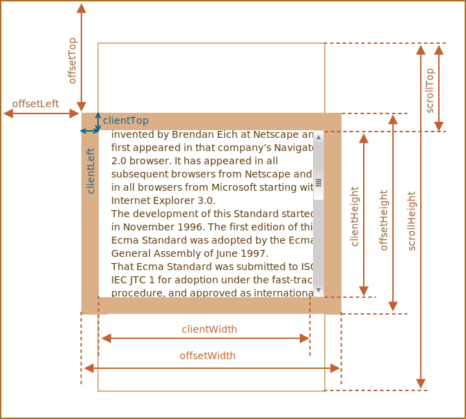

# 元素大小和滚动

## 示例元素

示例元素有边框（border），内边距（padding）和滚动（scrolling）等全套功能。但没有外边距（margin），因为它们不是元素本身的一部分。

## 几何

## Offset 系列

### offsetParent

`offsetParent` 是最接近的祖先（ancestor），在浏览器渲染期间，它被用于计算坐标。

最近的祖先为下列之一：

- CSS 定位的（`position` 为 `absolute`、`relative`、`fixed` 或 `sticky`）
- 或 `<td>`，`<th>`，`<table>`
- 或 `<body>`

有以下几种情况下，`offsetParent` 的值为 `null`：

- 对于未显示的元素（`display:none` 或者不在文档中）。
- 对于 `<body>` 与 `<html>`。
- 对于带有 `position:fixed` 的元素。

### offsetLeft/Top

属性 `offsetLeft/Top` 提供相对于 `offsetParent` 左上角的 x/y 坐标。

### offsetWidth/Height

`offsetWidth/Height` 提供了元素的“外部” `width/height`。或者，换句话说，它的完整大小（包括边框）。

## client 系列

### clientTop/Left

在元素内部，我们有边框（border）。为了测量它们，可以使用 `clientTop/Left`。……但准确地说，这些属性不是边框的 `width/height`，而是内侧与外侧的相对坐标。

### clientWidth/Height

`clientWidth/Height` 提供了元素边框内区域的大小。它们包括了 “content width” 和 “padding”，但不包括滚动条宽度（scrollbar）。

## scroll 系列

### scrollWidth/Height

`scrollWidth/Height` 就像 `clientWidth/Height`，但它们还包括滚动出（隐藏）的部分：

### scrollLeft/Top

`scrollLeft/Top` 是元素的隐藏、滚动部分的 `width/height`。换句话说，`scrollTop` 就是“已经滚动了多少”。

大多数几何属性是只读的，但是 `scrollLeft/Top` 是可修改的，并且浏览器会滚动该元素。

### scrollIntoView

[`scrollIntoView()`](https://developer.mozilla.org/zh-CN/docs/Web/API/Element/scrollIntoView) 方法会滚动元素的父容器，使被调用 `scrollIntoView()` 的元素对用户可见。

1. `scrollIntoView([alignToTop])`
   - 如果为 true，元素的顶端将和其所在滚动区的可视区域的顶端对齐。相应的 `scrollIntoViewOptions: { block: "start", inline: "nearest" }`。这是这个参数的默认值。
   - 如果为 false，元素的底端将和其所在滚动区的可视区域的底端对齐。相应的 `scrollIntoViewOptions: { block: "end", inline: "nearest" }`。 
2. `scrollIntoView(scrollIntoViewOptions)`
   - `behavior`：定义滚动是立即的还是平滑的动画。该选项是一个字符串，必须采用以下值之一：
     - `smooth`：滚动应该是平滑的动画。
     - `instant`：滚动应该通过一次跳跃立刻发生。
     - `auto`：滚动行为由 [`scroll-behavior`](https://developer.mozilla.org/zh-CN/docs/Web/CSS/scroll-behavior) 的计算值决定。
   - `block`：定义垂直方向的对齐，`start`、`center`、`end` 或` nearest` 之一。默认为 `start`。
   - `inline`：定义水平方向的对齐，`start`、`center`、`end` 或` nearest` 之一。默认为 `nearest`。
