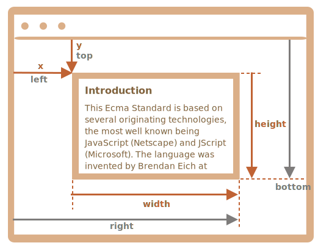

# 坐标

大多数 JavaScript 方法处理的是以下两种坐标系中的一个：

1. **相对于窗口** —— 类似于 `position:fixed`，从窗口的顶部/左侧边缘计算得出。

    我们将这些坐标表示为 `clientX/clientY`，当我们研究事件属性时，就会明白为什么使用这种名称来表示坐标。

2. **相对于文档** —— 与文档根（document root）中的 `position:absolute` 类似，从文档的顶部/左侧边缘计算得出。

    我们将它们表示为 `pageX/pageY`。

当页面滚动到最开始时，此时窗口的左上角恰好是文档的左上角，它们的坐标彼此相等。但是，在文档移动之后，元素的窗口相对坐标会发生变化，因为元素在窗口中移动，而元素在文档中的相对坐标保持不变。

当文档滚动了：

- `clientY` —— 窗口相对坐标确实发生了变化（箭头变短了），因为同一个点越来越靠近窗口顶部。
- `pageY` —— 元素在文档中的相对坐标保持不变，从文档顶部（现在已滚动出去）开始计算。

## 元素坐标 getBoundingClientRect()

[`el.getBoundingClientRect()`](https://developer.mozilla.org/zh-CN/docs/Web/API/Element/getBoundingClientRect) 返回最小矩形的窗口坐标，该矩形将 `el` 作为内建 [`DOMRect`](https://developer.mozilla.org/zh-CN/docs/Web/API/DOMRect) 类的对象。

主要的 `DOMRect` 属性：

- `x/y` —— 矩形原点相对于窗口的 X/Y 坐标，
- `width/height` —— 矩形的 width/height（可以为负）。
- 此外，还有派生（derived）属性：
  - top/bottom —— 顶部/底部矩形边缘的 Y 坐标，
  - left/right —— 左/右矩形边缘的 X 坐标。

