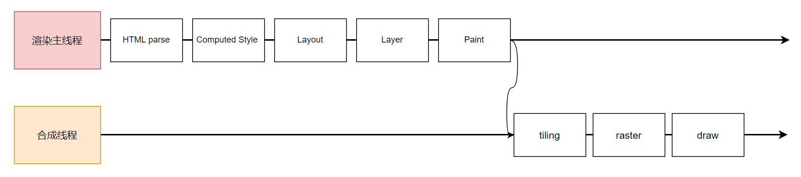

# 浏览器渲染原理

## 浏览器是如何渲染页面的 ？

当浏览器的网络进程收到 HTML 文档后，会产生一个渲染任务，并将其传递给渲染主线程的消息队列。

在事件循环机制的作用下，渲染主进程取出消息队列中的渲染任务，开启渲染流程。

整个渲染流程分为多个阶段，分别是：HTML解析、样式计算、布局、分层、绘制、分块、光栅化、画。

### （1）解析 HTML - parse HTML

渲染的第一步就是解析 HTML。

在解析的过程中遇到 CSS 解析 CSS，遇到 JS 执行 JS。为了提高解析效率，浏览器在开始解析前，会启动一个预解析的线程，率先下载 HTML 中的外部 CSS 和外部 JS 文件。

如果主线程解析到 link 位置，此时外部的 CSS 文件还没有下载解析好，主线程不会等待，继续解析后续的 HTML。这是因为下载和解析 CSS 的工作是在预解析线程中进行的。这就是 CSS 不会阻塞 HTML 解析的根本原因。

如果主线程解析到 script 位置，会停止解析 HTML，等待 JS 文件下载好，并将全局代码解析执行后，才能继续解析 HTML。这是因为 JS 代码的执行过程可能会修改当前的 DOM 树，所以 DOM 树的生成必须暂停。这就是 JS 会阻塞 HTML 解析的根本原因。

不过，如果 script 标签设置了 defer 或者 async 则会异步加载：

- async：在下载 script 的时候，仍会继续解析 HTML，当下载完成后，会停止解析 HTML，执行 JS。所以什么时候执行是不确定的，可能页面还没加载好就执行了，也有可能 HTML 解析完才会执行。因此比较适合第三方脚本。
- defer：解析 HTML 是不受阻的，即使 script 下载好了，也不会执行 JS，只有在 HTML 解析完之后才会执行。

完成 HTML 解析后，会得到 DOM 树和 CSSOM 树（浏览的的默认样式、内部样式、外部样式、行内样式均会包含在 CSSOM 树中）。

### （2）样式计算 - Computed Style

渲染的下一步就是样式计算。

主线程会遍历得到的 DOM 树，依次为树中的每个节点计算出它最终的样式，称之为 Computed Style。

在这一过程中，很多预设值都会变成绝对值，比如 red 变成 rgb(255,0,0)、相对单位变成绝对单位，比如 em 变成 px。

完成样式计算后，会得到带有样式的 DOM 树。

### （3）布局 - layout

接下来是布局。

布局阶段会遍历 DOM 树的每一个节点，计算每个节点的几何信息。例如节点的宽高、相对包含快的位置，得到 layout 树。

大部分的时候，DOM 树和 layout 树并非一一对应（DOM 树不等同于 layout 树）。

比如 display:node 的节点没有几何信息，因此不会生成到 layout 树；又比如使用了伪元素选择器，虽然 DOM 树中不存在这些伪元素节点，但它们拥有几何信息，所以会生成到 layout 树中。还有匿名行盒、匿名块盒等等都会导致 DOM 树和 layout 树无法一一对应。

### （4）分层 - layer

下一步是分层。

主线程会使用一套复杂的策略对整个 layout 树进行分层。

分层的好处在于，将来某一个层改变后，进队该层进行后续处理，从而提升效率。

滚动条、堆叠上下文、transform、opacity 等样式都会或多或少的影响分层结果，也可以通过 will-change 属性更大程度的影响分层结果。

### （5）绘制 - paint

再下一步就是绘制。

主线程会为每个层单独产生绘制指令集（类似于 canvas），用于描述这一层的内容该如何画出来。

完成绘制后，主线程将每个图层的绘制信息提交给合成线程，剩余工作将由合成线程完成。

### （6）分块 - tiling

合成线程首先对每个图层进行分块，将其划分为更多的小区域。

它会从线程池中拿取多个线程来完成分块工作。

### （7）光栅化 - raster

分块完成后，进入光栅化阶段。

合成线程会将块信息交给 GPU 进程，以极快的速度完成光栅化。

GPU 进程会开启多个线程来完成光栅化，并且优先处理靠近视口区域的块。

光栅化的结果，就是一块一块的位图。

### （8）画 - draw

最后一个阶段就是画。

合成线程拿到每个层、每个块的位图后，生成一个个 “quad” 信息。

指引信息会标识出每个位图应该画到屏幕的哪个位置，以及会考虑到旋转、缩放等变形。

变形发生在合成线程，与渲染主进程无关，这就是 transform 效率高的根本原因。

合成线程会把 quad 提交给 GPU 进程，由 GPU 进程产生系统调用，提交给 GPU 硬件，完成最终的屏幕成像。

## 相关知识

### 什么是 reflow ？

reflow（回流） 的本质就是重新计算 layout 树。

当进行了会影响 layout 树的操作后，需要重新计算 layout 树，会引发 reflow。

为了避免连续多次操作导致 layout 树反复计算，浏览器会合并这些操作，当 JS 代码全部完成后再进行统一计算。所以，改动属性造成的 reflow 是异步完成的。

**注意**：也同样因为如此，当 JS 获取布局属性时（如：clientWidth），就可能造成无法获取到最新的布局信息，浏览器为了获取这些信息，也会引发 reflow。

### 什么是 repaint ？

repaint（重绘） 的本质就是重新根据分层信息计算了绘制指令。

当改动了可见样式后，就需要重新计算，会引发 repaint。

由于元素的布局信息也属于可见样式，所以 reflow 一定会引发 repaint。

### 为什么 transform 效率高 ？

因为 transform 既不会影响布局，也不会影响到绘制指令，它影响的只是渲染流程的最后一个 draw 阶段。

由于 draw 阶段在合成线程中，所以 transform 的变化几乎不会影响渲染主进程。反之，渲染主进程无论多么忙碌，也不会影响到 transform 的变化。
