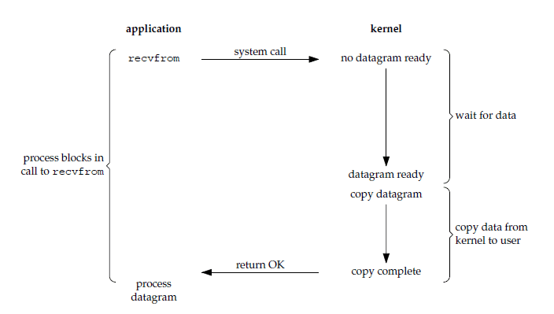
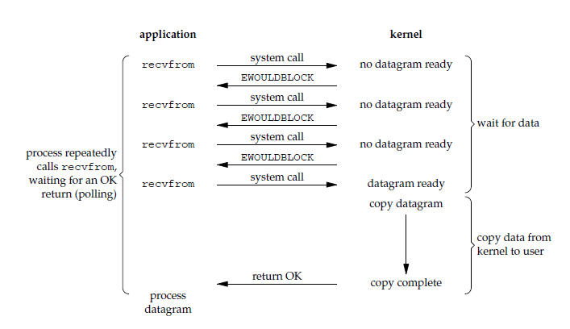
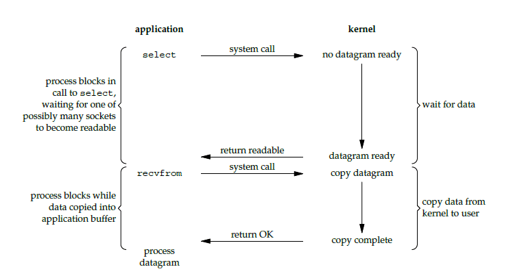
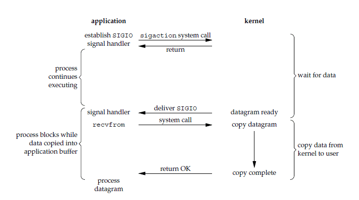
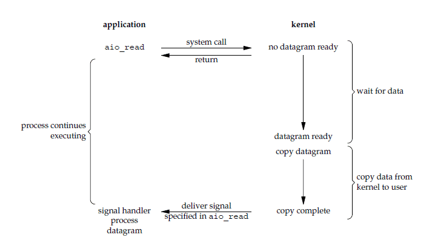

# I/O 模型

## 什么是 I/O ？

 I/O 即 Input/Output，直译过来就是输入/输出。

从计算机层面来看，鼠标键盘等输入设备会将指令输入给主机，主机将运算结果反馈在显示器或者打印机等输出设备上，这个过程就是一次 I/O 。

## Unix I/O 模型

### 阻塞 I/O 模型

阻塞 I/O 模型（Blocking I/O Model）：在这种模型中，当程序发起 I/O 操作时，程序会被阻塞（即暂停执行），直到 I/O 操作完成。这种模型的简单，但可能会浪费 CPU 性能，因为程序在等待 I/O 完成时无法执行其他任务。

### 非阻塞 I/O 模型

非阻塞 I/O 模型（Non-blocking I/O Model）：在这种模型中，程序发起 I/O 操作后，可以继续执行其他任务，而不会被阻塞。程序需要定期轮询（poll） I/O 操作的状态（fd），以确定是否完成。这种模型可以提高程序的并发性，但需要额外的编程工作。

### 多路复用 I/O 模型

多路复用 I/O 模型（Multiplexing I/O Model）：这种模型使用了操作系统提供的多路复用机制，如select、poll或epoll。程序可以同时监视多个 I/O 操作的状态，当其中任何一个 I/O 操作就绪时，程序才会被唤醒进行处理。这种模型可以高效地处理多个 I/O 操作，减少了不必要的轮询。

> fd：文件描述符（File Descriptor），它是计算机科学中的一个术语，形式上是一个非负整数。当程序打开一个现有文件或者创建一个新文件时，内核向进程返回一个文件描述符。

**select** vs **poll** vs **epoll**

|              | select                                               | poll                                               | epoll                                                        |
| ------------ | ---------------------------------------------------- | -------------------------------------------------- | ------------------------------------------------------------ |
| 底层数据结构 | 数组                                                 | 链表                                               | 红黑树和双链表                                               |
| 获取就绪的fd | 遍历                                                 | 遍历                                               | 事件回调                                                     |
| 时间复杂度   | O(n)                                                 | O(n)                                               | O(1)                                                         |
| 最大连接数   | 1024                                                 | 无限制                                             | 无限制                                                       |
| fd数据拷贝   | 每次调用select，需要将fd数据从用户空间拷贝到内核空间 | 每次调用poll，需要将fd数据从用户空间拷贝到内核空间 | 使用内存映射(mmap)，不需要从用户空间频繁拷贝fd数据到内核空间 |

### 信号驱动 I/O 模型

信号驱动 I/O 模型（Signal-Driven I/O Model）：在这种模型中，程序通过注册信号处理器（signal handler）来处理 I/O 事件。当 I/O 操作就绪时，操作系统会向程序发送一个信号，然后程序会执行相应的信号处理函数来处理 I/O 数据。

### 异步非阻塞 I/O 模型

异步 I/O 模型（Asynchronous I/O Model）：在这种模型中，程序发起 I/O 操作后，不需要轮询或阻塞，而是可以继续执行其他任务。当 I/O 操作完成时，系统会通知程序，以便进一步处理数据。异步 I/O 需要使用特定的API和编程模型，但可以提供高度的并发性和性能。
