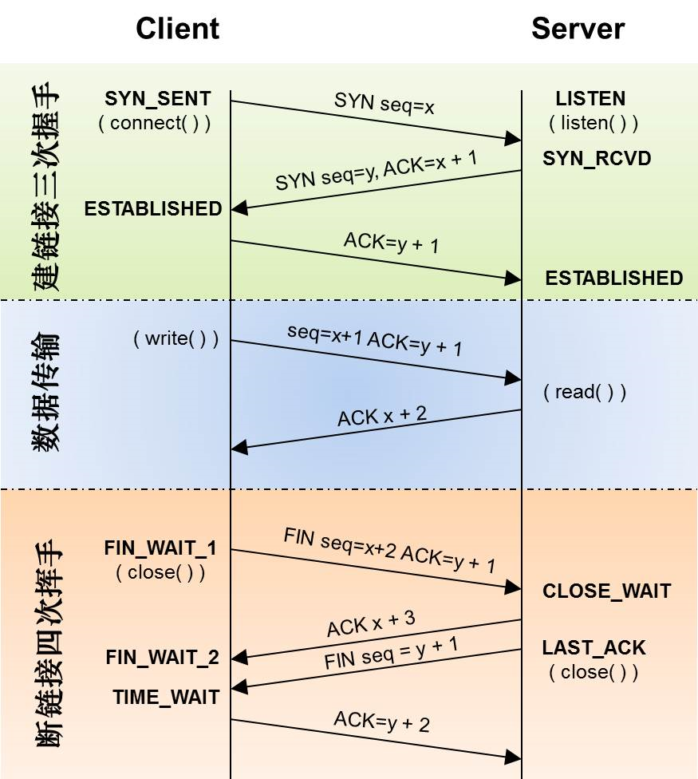

# HTTP

> [HTTP - MDN](https://developer.mozilla.org/zh-CN/docs/Web/HTTP)

超文本传输协议（HTTP）是一个用于传输超媒体文档（例如 HTML）的应用层协议。它是为 Web 浏览器与 Web 服务器之间的通信而设计的，但也可以用于其他目的。HTTP 遵循经典的客户端—服务端模型，客户端打开一个连接以发出请求，然后等待直到收到服务器端响应。HTTP 是无状态协议，这意味着服务器不会在两个请求之间保留任何数据（状态）。

## HTTP 协议工作流程

1. 原始状态：客户端与服务器没有任何关系。
2. 客户端向服务器发送请求，三次握手，建立连接。
3. 服务器根据连接，响应数据。
4. 四次挥手，断开连接，回到原始状态。

### 三次握手 & 四次挥手

- 三次握手的作用就是建立连接。
- 四次挥手的作用就是断开连接。

## 请求报文结构

1. 请求行：请求方法类型 + 请求URL + HTTP协议版本
2. 请求头
3. 空行
4. 请求体

## 响应报文结构

1. 响应行：HTTP协议版本 + 响应状态码 + 响应状态文字
2. 响应头
3. 空行
4. 响应体

## HTTP 请求方法

根据 HTTP 标准，HTTP 请求可以使用多种请求方法。
HTTP/1.0 定义了三种请求方法： GET、HEAD、POST。
HTTP/1.1 新增了六种请求方法：PUT、PATCH、DELETE、OPTIONS、TRACE、CONNECT。
注意：这些请求方法虽然是 HTTP 协议里规定的，但是 WEB SERVICE 未必允许或支持这些方法。

| **方法**    | **描述**                                                                                                                                 | **安全性** | **幂等性** |
| ----------- | ---------------------------------------------------------------------------------------------------------------------------------------- | ---------- | ---------- |
| **GET**     | 请求指定的页面信息，并返回实体主体。                                                                                                     | 是         | 是         |
| **HEAD**    | 类似于 GET 请求，只不过返回的响应中没有具体的内容，用于获取报头。                                                                        | 是         | 是         |
| **POST**    | 向指定资源提交数据进行处理请求（例如提交表单或者上传文件）。数据被包含在请求体中。POST 请求可能会导致新的资源的建立和/或已有资源的修改。 | 不是       | 不是       |
| **PUT**     | 从客户端向服务器传送的数据取代指定的文档的内容。                                                                                         | 不是       | 是         |
| **PATCH**   | 是对 PUT 方法的补充，用来对已知资源进行局部更新 。                                                                                       | 不是       | 不是       |
| **DELETE**  | 请求服务器删除指定的页面。                                                                                                               | 不是       | 是         |
| **OPTIONS** | 允许客户端查看服务器的性能。                                                                                                             | -          | -          |
| **TRACE**   | 回显服务器收到的请求，主要用于测试或诊断。                                                                                               | -          | -          |
| **CONNECT** | HTTP/1.1 协议中预留给能够将连接改为管道方式的代理服务器。                                                                                | -          | -          |

## HTTP 状态码

[HTTP 状态码](https://zh.wikipedia.org/zh-hans/HTTP%E7%8A%B6%E6%80%81%E7%A0%81)

## HTTP 防盗链原理

qq空间中图片，与百度贴吧中图片不允许站外引入，其原理就是服务器通过 HTTP 协议中 **referer 头** 来进行判断是不是本站引用，若不是本站引用就直接拦截。

## HTTP 缓存

**现象**：基于一个前提：图片不会经常改动。在浏览器访问图片时，第一次请求，**200 Ok**，第二次请求时，**304 Not Modified（未修改）**

**原因**：浏览器自身有缓存功能，当第一次正常访问图片时，返回 200 OK，另外还返回图片的“签名”-- Etag。当浏览器再次访问到这个图片时，会去服务器进行“签名”的校验，如果图片没有变化，那么就直接使用缓存中的图片。这样可以减轻服务器的压力。

## Cookie

存储在浏览器的一串字符串，不超过 4kb，由一个键值对，和其他几个用于控制 cookie 有效期，安全性，适用范围的可选属性组成。
不同域名下的 cookie 各自独立
每当客户端发起请求时，会自动把当前域名下所有未过期的 cookie 一同发给服务器

## Session

## http 的无状态性

http 无状态性，指的是客户端每次的 http 请求都是独立的，连续多次请求之间没有直接关系，服务器不会主动保留每次 http 请求的状态。
如何突破 http 无状态性的限制？
通过 cookie 来标识身份，这种方式可以突破 http 无状态性的限制。

## 状态码

200
204

HTTP 状态码 301, 302, 307 和 308 都表示重定向，但它们的行为和使用场景有所不同。以下是它们的详细区别：

### 301 Moved Permanently（永久重定向）

- **含义**：资源已被永久移动到新位置。
- **客户端行为**：客户端（包括浏览器和搜索引擎）应该使用新的 URL 进行请求，并在未来的请求中继续使用该新的 URL。
- **使用场景**：网站迁移到新域名、永久性 URL 改变。

### 302 Found（临时重定向）

- **含义**：资源临时移动到新位置。
- **客户端行为**：客户端应该使用新的 URL 进行本次请求，但未来的请求应继续使用原来的 URL。
- **使用场景**：临时重定向，例如维护期间的页面重定向。

### 307 Temporary Redirect（临时重定向）

- **含义**：资源临时移动到新位置，但请求方法和主体不会改变。
- **客户端行为**：客户端应使用新的 URL 进行本次请求，但未来的请求应继续使用原来的 URL，并且保持请求方法不变（如 POST 请求保持为 POST）。
- **使用场景**：类似于 302，但在 HTTP/1.1 中更明确地指出请求方法不变。

### 308 Permanent Redirect（永久重定向）

- **含义**：资源已被永久移动到新位置，请求方法和主体不会改变。
- **客户端行为**：客户端应该使用新的 URL 进行请求，并在未来的请求中继续使用该新的 URL，且保持请求方法不变。
- **使用场景**：类似于 301，但在 HTTP/1.1 中更明确地指出请求方法不变。

### 对比总结

- **301 与 308**：都表示永久重定向，但 308 明确请求方法不变。
- **302 与 307**：都表示临时重定向，但 307 明确请求方法不变。

总的来说：

- 301 和 308 用于永久重定向，区别在于 308 保持请求方法不变。
- 302 和 307 用于临时重定向，区别在于 307 保持请求方法不变。
