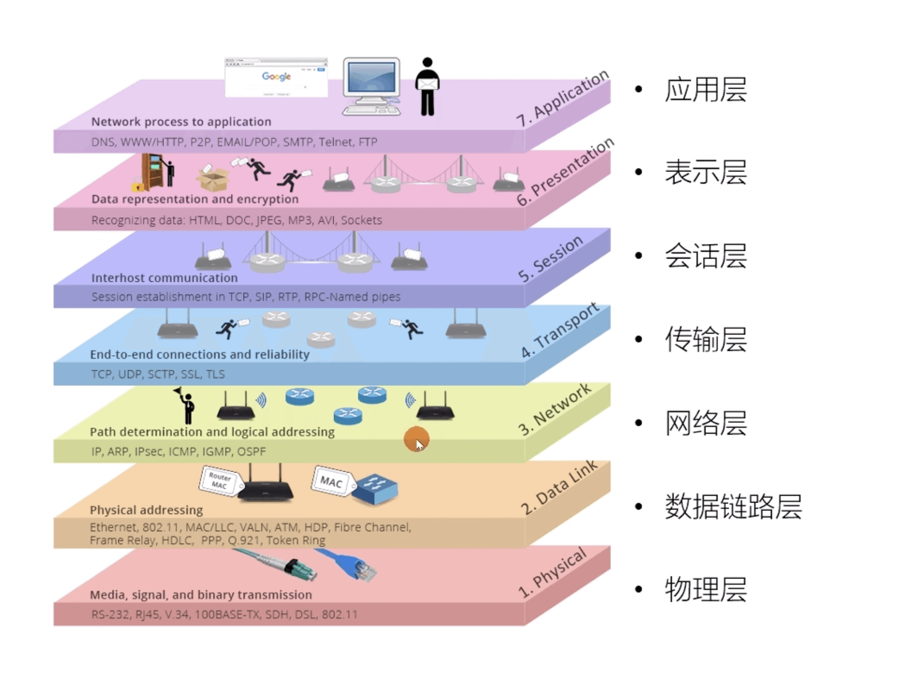

# 网络模型

## OSI 七层模型

OSI（Open System Interconnection Reference Model）是一个概念模型，也就是说 OSI 从来没有被真正的实现过，但是又是在做网络协议时必须参考的一个模型。

由上至下分为七层：

1. 应用层
2. 表示层
3. 会话层
4. 传输层
5. 网络层
6. 数据链路层
7. 物理层

## TCP/IP 四层模型

TCP/IP 四层模型 是目前被广泛采用的一种模型,我们可以将 TCP / IP 模型看作是 OSI 七层模型的精简版本，由上至下以 4 层组成：

1. 应用层
2. 传输层
3. 网络层
4. 网络接口层

::: tip TCP/IP 五层模型
你可能会看到，有些地方也会将 TCP/IP 模型分为“五层”，其实和 TCP/IP 四层模型类似：

1. 应用层
2. 传输层
3. 网络层
4. 数据链路层
5. 物理层

可参考：<https://developerhelp.microchip.com/xwiki/bin/view/applications/tcp-ip/five-layer-model-and-apps/>
:::
