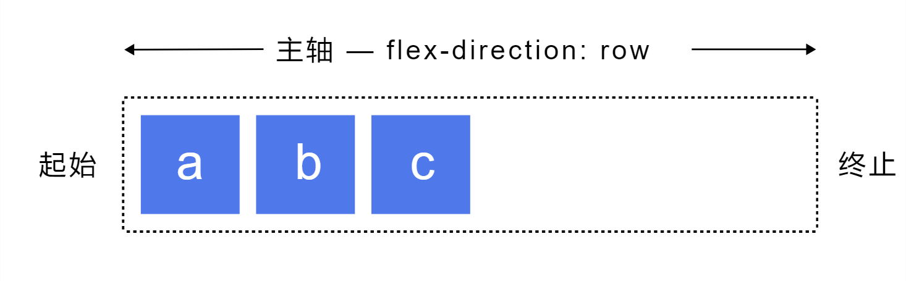
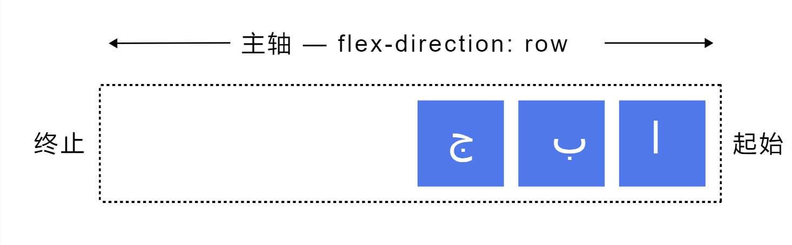
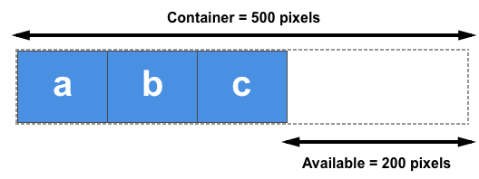
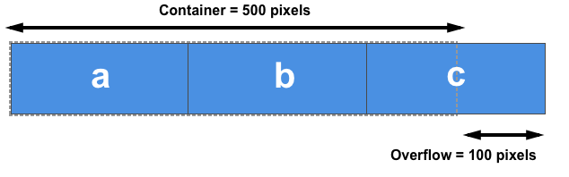
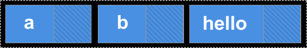

# flexbox

> [flexbox](https://developer.mozilla.org/zh-CN/docs/Web/CSS/CSS_flexible_box_layout/Basic_concepts_of_flexbox)

flexbox 是一种一维的布局，是因为一个 flexbox 一次只能处理一个维度上的元素布局，一行或者一列。

## flexbox

我们把一个容器的 `display` 属性值改为 `flex` 或者 `inline-flex`。完成这一步之后，容器中的直系子元素就会变为 **flex 元素**。由于所有 CSS 属性都会有一个初始值，所以 flexbox 中的所有 flex 元素都会有下列行为：

- 元素排列为一行（`flex-direction` 属性的初始值是 `row`）。
- 元素从主轴的起始线开始。
- 元素不会在主维度方向拉伸，但是可以缩小。
- 元素被拉伸来填充交叉轴大小。
- `flex-basis` 属性为 `auto`。
- `flex-wrap` 属性为 `nowrap`。

flex item 呈线形排列，并且把自己的大小作为主轴上的大小。如果有太多元素超出容器，它们会溢出而不会换行。如果一些元素比其他元素高，那么元素会沿交叉轴被拉伸来填满它的大小。

<iframe width="100%" height="480" src="https://mdn.github.io/css-examples/flexbox/basics/the-flex-container.html" loading="lazy"></iframe>

## `flex-direction`

当使用 flexbox 时，首先想到的是两根轴线：**主轴** 和 **交叉轴**。

**交叉轴垂直于主轴**。

### 主轴和交叉轴

主轴方向由 [`flex-direction`](https://developer.mozilla.org/zh-CN/docs/Web/CSS/flex-direction) 定义，默认值为 `row`。

<iframe width="100%" height="400" src="https://interactive-examples.mdn.mozilla.net/pages/css/flex-direction.html" loading="lazy"></iframe>

### 起始线和终止线

过去，CSS 的书写模式主要被认为是水平的，从左到右的。现代的布局方式涵盖了书写模式的范围，所以我们不再假设一行文字是从文档的左上角开始向右书写，新的行也不是必须出现在另一行的下面。

如果 `flex-direction` 是 `row`，并且我是在书写英文，那么主轴的起始线是左边，终止线是右边。

如果我在书写阿拉伯文，那么主轴的起始线是右边，终止线是左边。

## 对齐 flexbox 中的 flex item

### `justify-content`

主轴上所有 flex item 的对齐由 [`justify-content`](https://developer.mozilla.org/zh-CN/docs/Web/CSS/justify-content) 定义，默认值为 `normal`。

<iframe width="100%" height="400 "src="https://interactive-examples.mdn.mozilla.net/pages/css/justify-content.html" loading="lazy"></iframe>

### `align-items`

交叉轴 flexbox 上所有 flex item 的对齐由 [`align-items`](https://developer.mozilla.org/zh-CN/docs/Web/CSS/align-items) 定义，默认值为 `normal`。

<iframe width="100%" height="400 "src="https://interactive-examples.mdn.mozilla.net/pages/css/align-items.html" loading="lazy"></iframe>

### `align-self`

控制交叉轴 flexbox 上的单个 flex item 的对齐由 [`align-self`](https://developer.mozilla.org/zh-CN/docs/Web/CSS/align-self) 定义，默认值为 `auto`。

<iframe width="100%" height="400 "src="https://interactive-examples.mdn.mozilla.net/pages/css/align-self.html" loading="lazy"></iframe>

### `align-content`

控制 **“多条主轴”** 的 flex item 在交叉轴的对齐由 [`align-content`](https://developer.mozilla.org/zh-CN/docs/Web/CSS/align-content) 定义，默认值为 `normal`。

<iframe width="100%" height="400 "src="https://interactive-examples.mdn.mozilla.net/pages/css/align-content.html" loading="lazy"></iframe>

## 控制 flex item 在主轴上的比例

为了更好地控制 flex item，有三个属性可以作用于它们：

- [`flex-grow`](https://developer.mozilla.org/zh-CN/docs/Web/CSS/flex-grow)：该元素获得（伸张）多少正可用空间（positive free space）？
- [`flex-shrink`](https://developer.mozilla.org/zh-CN/docs/Web/CSS/flex-shrink)：该元素要消除（收缩）多少负可用空间（negative free space）？
- [`flex-basis`](https://developer.mozilla.org/zh-CN/docs/Web/CSS/flex-basis)：在该元素未伸张和收缩之前，它的大小是多少？

### 正负可用空间

去谈论这些属性之前我们需要理解 **正负可用空间（positive and negative free space）** 的概念。当一个 flexbox 有正可用空间时，它就有更多的空间用于在容器内显示 flex item。

比如说，如果我们有 500px 宽的容器，`flex-direction` 属性值为 `row`，三个 100px 宽的 flex item，那么我们还有 200px 的正可用空间，如果我们想要填充整个容器，则可将其分配到元素中。

当 flex item 的自然尺寸加起来比 flexbox 内的可用空间大时，我们产生了负可用空间。比如我们有一个像上面那样的 500px 宽的容器，但是三个 flex item 每个都为 200px 宽，那我们就一共需要 600px 宽，因此就有了 100px 的负可用空间。这可以从 flex item 中删除以使其能适应容器。

### `flex-basis`

`flex-basis` 属性在任何空间分配发生之前初始化 flex item 的尺寸。此属性的初始值为 `auto`。如果 `flex-basis` 设置为 `auto`，浏览器会先检查元素的主尺寸是否设置了绝对值再计算出它们的初始值。比如说你已经给你的元素设置了 200px 的宽，则 200px 就是这个元素的 `flex-basis`。

如果你的元素为自动调整大小，则 auto 会解析为其内容的大小。此时你所熟知的 `min-content` 和 `max-content` 大小会变得有用，弹性盒子会将元素的 `max-content` 大小作为 `flex-basis`。

<iframe width="100%" height="520" src="https://mdn.github.io/css-examples/flexbox/ratios/flex-basis.html" loading="lazy"></iframe>

除了 `auto` 关键字以外，你还可以使用 `content` 关键字作为 `flex-basis` 的值。这会导致即使元素设置了宽度，`flex-basis` 还是会根据内容大小进行设置。你也可以通过设置 `flex-basis` 为 auto 并确保你的元素没有设置宽度来达到相同的效果，以便它能自动调整大小。

空间分配时，如果你想要弹性盒子完全忽略元素的尺寸就需要设置 `flex-basis` 为 0。这显式地说明弹性盒子可用抢占所有空间，并按比例进行分配。

### `flex-grow`

`flex-grow` 属性指定了弹性增长因子（flex grow factor），这决定了在分配正可用空间时，弹性元素相对于弹性容器中的其余弹性元素的增长程度。

如果你所有的元素都设置了相同的 `flex-grow` 属性值，那么空间将会在它们之间平均分配。如果你想要这种情形，通常你需要使用 1 作为值，但如果你喜欢你还可以将它们的 `flex-grow` 都设置为 88、100 或 1.2，这些只是个比例。如果 `flex-grow` 的值全部相同，并且在弹性容器中还有正可用空间，那么它就会被平均地分配给所有元素。

#### 结合 `flex-grow` 和 `flex-basis`

`flex: 1 1 auto;`：这个例子中设置 `flex-basis` 的值为 auto 且没有设置它们的宽，因此它们是自动调整大小的。这意味着弹性盒子的大小取决于元素的 [`max-content`](https://developer.mozilla.org/zh-CN/docs/Web/CSS/max-content) 大小。在布局完元素之后，弹性容器中还有一些正可用空间，展示在这幅图片的阴影区域中：

我们使用与内容大小相等的 `flex-basis`，以便从总可用空间（弹性容器的宽度）中减去可用分配空间，然后剩余空间在每个元素之间平均分配。我们比较大的元素最终会变得更大，因为它一开始就有一个比较大的尺寸，即使它与其他元素具有相同的分配空间：

如果你真正想要的是三个同样尺寸的元素，即使它们开始具有不同的尺寸，你应该使用这个：`flex: 1 1 0;`。

为了我们的空间分配，元素的尺寸计算值是 0（所有空间都用来争夺），并且所有元素具有相同的 `flex-grow` 值，它们每个都获得相等的空间分配。最终结果是三个等宽的可伸缩元素。

<iframe width="100%" height="520" src="https://mdn.github.io/css-examples/flexbox/ratios/flex-grow.html" loading="lazy"></iframe>

#### 为 flex item 设置不同的 `flex-grow` 因子

`flex-basis` 值为 0 意味着可用空间都可以被分配。我们需要将弹性增长因子相加，然后将弹性容器的正可用空间总量除以该值，在这个例子中为 4。而后我们就可以根据每一个的值分配空间（第一个元素得到一个单位、第二个元素得到一个单位、第三个元素得到二个单位）。也就是说第三个元素是第一个和第二个元素的两倍。

<iframe width="100%" height="520" src="https://mdn.github.io/css-examples/flexbox/ratios/flex-grow-ratios.html" loading="lazy"></iframe>

### `flex-shrink`

`flex-shrink` 属性指定了弹性收缩因子（flex shrink factor），它确定在分配负可用空间时，弹性元素相对于弹性容器中其余弹性元素收缩的程度。

该属性用于处理浏览器计算弹性元素的 `flex-basis` 值，并发现它们太大以至于无法适应弹性容器的情形。只要 `flex-shrink` 有正值，元素就会收缩以至于它们不会溢出容器。

因此 `flex-grow` 用于添加可用空间，而 `flex-shrink` 减少空间来使盒子适应它们的容器而不溢出。

<iframe width="100%" height="500" src="https://mdn.github.io/css-examples/flexbox/ratios/flex-shrink-min-content.html" loading="lazy"></iframe>

#### 结合 `flex-shrink` 和 `flex-basis`

在下面的例子中，在 `flex-basis` 解析为内容大小的位置你会看到 `min-content` 的铺设。如果你改变弹性容器的宽度——比如增加到 700px 宽，再减少弹性元素的宽度，你会看到前两个元素将换行，但是它们绝不会小于 `min-content` 的大小。随着盒子变得越来越小，第三个元素随后从空间中溢出。

<iframe width="100%" height="500" src="https://mdn.github.io/css-examples/flexbox/ratios/flex-shrink-min-content.html" loading="lazy"></iframe>

#### 给 flex item 设置不同的 `flex-shrink` 因子

在下面的示例中第一个元素设置 `flex-shrink` 的值为 1、第二个为 0（因此它将不会收缩）、第三个为 4。第三个元素比第一个收缩的更快。任意设置不同的值——你可以给 `flex-grow` 使用小数或者大一点的数。选择对于你来说任意合理的数。

<iframe width="100%" height="570" src="https://mdn.github.io/css-examples/flexbox/ratios/flex-shrink-ratios.html" loading="lazy"></iframe>

## flex item 排序

除了颠倒显示弹性项目的顺序之外，还可以使用 [`order`](https://developer.mozilla.org/zh-CN/docs/Web/CSS/order) 属性指定单个项目并更改其在视觉顺序中的显示位置。

## `flex-wrap`

虽然 flexbox 是一维模型，但可以使我们的 flex item 应用到多行中。在这样做的时候，应该把每一行看作一个新的 flexbox 。任何空间分布都将在该行上发生，而不影响该空间分布的其他行。

为了实现多行效果，请为属性 [`flex-wrap`](https://developer.mozilla.org/zh-CN/docs/Web/CSS/flex-wrap) 添加一个属性值 `wrap`。现在，如果 item 太大而无法全部显示在一行中，则会换行显示。

若将其设置为 `nowrap`，这也是初始值，它们将会缩小以适应容器，因为它们使用的是允许缩小的初始 flexbox 值。如果 item 的子元素无法缩小，使用 `nowrap` 会导致溢出，或者缩小程度还不够小。

`flex-wrap` 常见值如下：

- `nowrap`：不换行。
- `wrap`：换行，溢出后向下排列。
- `wrap-reverse`：和 `wrap` 的行为一样，但是 cross-start 和 cross-end 互换。

<iframe width="100%" height="400" src="https://mdn.github.io/css-examples/flexbox/basics/flex-wrap.html" loading="lazy"></iframe>

## 在 items 之间建立间隔

> [gap](https://developer.mozilla.org/zh-CN/docs/Web/CSS/gap)

<iframe width="100%" height="400" src="https://interactive-examples.mdn.mozilla.net/pages/css/gap.html" loading="lazy"></iframe>

## 简写属性

### `flex-flow`

> [`flex-flow`](https://developer.mozilla.org/zh-CN/docs/Web/CSS/flex-flow)

<iframe width="100%" height="400" src="https://mdn.github.io/css-examples/flexbox/basics/flex-flow.html" loading="lazy"></iframe>

### `flex`

> [`flex`](https://developer.mozilla.org/zh-CN/docs/Web/CSS/flex)

<iframe width="100%" height="400" src="https://interactive-examples.mdn.mozilla.net/pages/css/flex.html" loading="lazy"></iframe>

## flex 问题记录

### flex-end 为什么 overflow 无法滚动

> 参考资料：<https://www.zhangxinxu.com/wordpress/2021/12/flex-end-overflow/>

问题描述：在 `flex` 布局中，如果整体列表项元素的对齐方式是 `flex-end`，则当里面的内容超过容器的时候，即使容器设置了 `overflow:auto` 也是无法有滚动效果的。

问题原因：`flex-end` 之所以不会出现滚动条，就是因为里面内容溢出容器的方向不是在容器的下方或者右侧，而是在容器的顶部和左侧，自然就无法触发滚动条的出现。

解决方案：解决方法很简单，对齐方式开始默认的 flex 对齐，然后使用 margin: auto` 实现 **end 对齐** 就可以了。
