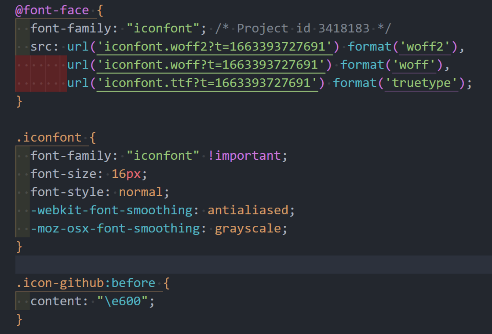

# 字体图标

## 图标的发展

1. 雪碧图 / 精灵图 / CSS sprites
2. Font Icon
   - 只能控制字体相关属性
   - 通常下载的文件字体较大
3. Inline SVG
   - svg 可以完全控制

## 常见图标库

1. [iconfont](https://www.iconfont.cn/)
2. [Font Awesome](https://fontawesome.com/)
3. [Bootstrap Icons](https://icons.getbootstrap.com/)

## 引入字体

1. 引入字体（如：[Google Fonts](https://fonts.google.com/) ）。

    <!-- tabs:start -->
    <!-- tab:link 标签导入 -->
    ```html
    <link rel="preconnect" href="https://fonts.googleapis.com">
    <link rel="preconnect" href="https://fonts.gstatic.com" crossorigin>
    <link href="https://fonts.googleapis.com/css2?family=Roboto:ital@0;1&display=swap" rel="stylesheet">
    ```

    <!-- tab: CSS 导入 -->
    ```css
    @import url('https://fonts.googleapis.com/css2?family=Roboto:ital@0;1&display=swap');
    ```
    <!-- tabs:end -->

2. 使用。

    ```css
    body {
      font-family: 'Roboto', sans-serif;
    }
    ```

## 引入图标

以 [iconfont](https://www.iconfont.cn/) 为例，参阅 iconfont [使用说明](https://www.iconfont.cn/help/detail?spm=a313x.manage_type_myprojects.i1.d8cf4382a.420a3a81EgiNB0&helptype=code)。

## 伪元素插入字体图标

> 场景：有时候我们用到了某个第三方组件，此时我们想修改下组件内的某个图标，替换成我们自己的图标，该如何实现？

首先来看看 iconfont 到底是怎样定义自己的图标的。



我们发现，它其实就是根据 [@font-face](https://developer.mozilla.org/zh-CN/docs/Web/CSS/@font-face) 自定义了一套字体。接着定义一个 `iconfont` 类名，定义基本的图标样式，再通过不同类名如：`icon-github`、`icon-google` …… 给伪元素设置 `content` 内容，来定义不同的图标类型。所以一般在使用的时候，我们直接添加 class 就可以引入图标了。

在了解原理后，我们直接给第三方组件内的某个图标元素的伪元素设置 `content` 不就好了好。

```css
/* 1.引入 iconfont 字体 */
@import url(./iconfont/iconfont.css);

/* 2.给需要的元素指定 iconfont 字体 */
.foo::before {
  font-family: 'iconfont';
  content: '\e600';
}
```

## 伪元素设定图片背景

有时候，我们不太方便更新字体图标，又或者没有找到合适的图标，这时候我们就可以采用图片作为伪元素背景，来达到一种类似的效果。其实，这种也不算是引入字体和图标，算是临时解决问题的一种方案。

```css
.foo::after {
  content: '';
  display: inline-block;
  width: 16px;
  height: 16px;
  background: url(./fe.png) no-repeat scroll center/cover;
}
```
