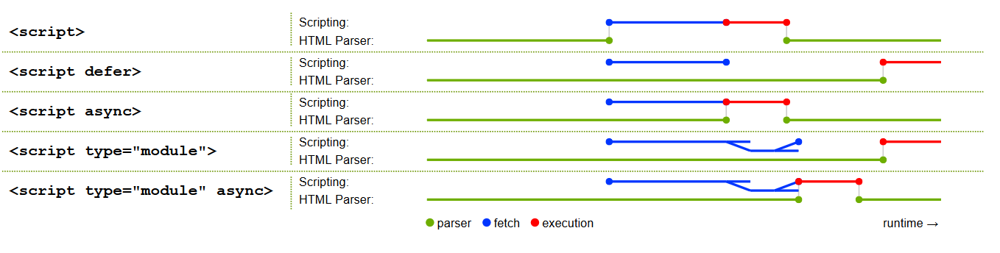

# `<script>` 元素加载

> [Example Demo](https://github.com/VfanLee/vfan-docs/tree/main/examples/defer_async_module)

1. `type="module"`、`async`、`defer` 都会将 `<script>` 改为 **异步加载**。
2. `<script type="module">` 和 `<script type="module" defer>` 效果类似。
3. 如果 `<script>` 元素同时使用 `async` 和 `defer`，那么 `async` 会覆盖 `defer`，即脚本将异步加载并在下载完成后立即执行。

