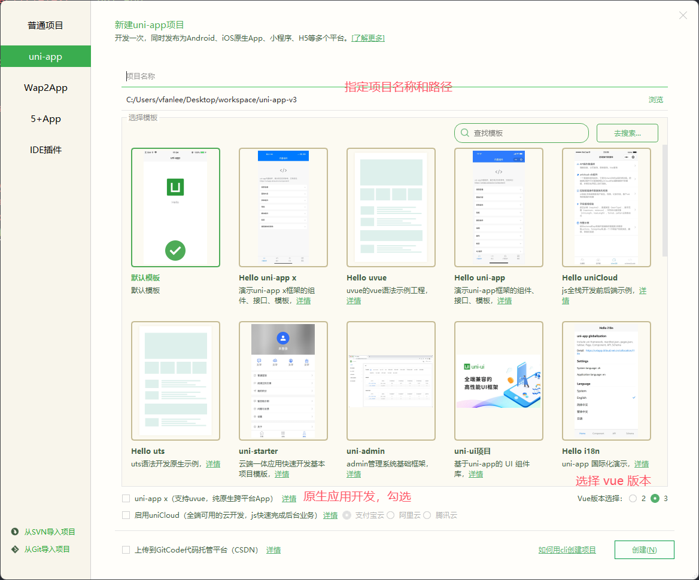

# uni-app

## 参考资料

- [uni-app 官方文档](https://uniapp.dcloud.net.cn/)

## 创建 uni-app 项目

### HBuilderX



## 工程目录

```sh
┌─uniCloud              # 云空间目录，支付宝小程序云为uniCloud-alipay，阿里云为uniCloud-aliyun，腾讯云为uniCloud-tcb
│─components            # 符合vue组件规范的uni-app组件目录
│  └─comp-a.vue         # 可复用的a组件
├─utssdk                # 存放uts文件
├─pages                 # 业务页面文件存放的目录
│  ├─index
│  │  └─index.vue       # index页面
│  └─list
│     └─list.vue        # list页面
├─static                # 存放应用引用的本地静态资源（如图片、视频等）的目录，注意：静态资源都应存放于此目录
├─uni_modules           # 存放uni_module
├─platforms             # 存放各平台专用页面的目录
├─nativeplugins         # App原生语言插件
├─nativeResources       # App端原生资源目录
│  ├─android            # Android原生资源目录
│  └─ios                # iOS原生资源目录
├─hybrid                # App端存放本地html文件的目录
├─wxcomponents          # 存放微信小程序、QQ小程序组件的目录
├─mycomponents          # 存放支付宝小程序组件的目录
├─swancomponents        # 存放百度小程序组件的目录
├─ttcomponents          # 存放抖音小程序、飞书小程序组件的目录
├─kscomponents          # 存放快手小程序组件的目录
├─jdcomponents          # 存放京东小程序组件的目录
├─unpackage             # 非工程代码，一般存放运行或发行的编译结果
├─main.js               # Vue初始化入口文件
├─App.vue               # 应用配置，用来配置App全局样式以及监听 应用生命周期
├─pages.json            # 配置页面路由、导航条、选项卡等页面类信息
├─manifest.json         # 配置应用名称、appid、logo、版本等打包信息
├─AndroidManifest.xml   # Android原生应用清单文件
├─Info.plist            # iOS原生应用配置文件
└─uni.scss              # 内置的常用样式变量
```

👉 [查看更多](https://uniapp.dcloud.net.cn/tutorial/project.html)
