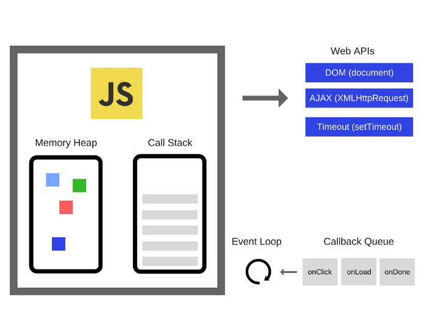

# 事件循环

## 渲染主进程如何调度任务？

1. 在最开始的时候，渲染主进程会进入一个无限循环。
2. 每一次循环会检查消息队列中是否有任务存在：

    - 如果有，就取出第一个任务执行，执行完第一个后进入下一次循环；
    - 如果没有，则进入休眠状态。

3. 其他所有线程（包括其他进程的线程）可以随时向消息队列中添加任务。新任务会加到消息队列的末尾。在添加新任务时，如果主进程时休眠状态的，则会唤醒继续循环拿取任务执行。

这样一来，每个任务都可以有条不紊、持续地进行下去了。而这一个过程，就被称为 **事件循环（消息循环）**。

## 如何理解 JavaScript 异步？

JS 是一门单线程的语言，这是因为它运行在浏览的渲染主进程中，而渲染主进程只有一个。

渲染主进程承担着诸多工作，渲染页面、执行 JS 都在其中运行。如果使用同步地方式，很容易导致主线程产生阻塞，从而导致消息队列中的其他任务无法得到执行。这样一来，一方面会导致繁忙地主进程白白消耗时间，另一方面，页面无法及时更新，造成卡死现象。

所以浏览器采用了异步的方式来避免这些问题。

## JavaScript 如何实现异步？

JavaScript 作为一门单线程语言，异步能力由 JavaScript Runtime (Environment) 所决定。

在浏览器（Chrome 为例）中， JavaScript Runtime 由以下几个部分组成：

1. **内存栈（Call Stack）**：内存栈是 JavaScript 引擎（例如 V8 引擎）提供的一部分，用于管理函数调用和执行上下文。它跟踪函数的调用顺序和变量的作用域。
2. **内存堆（Heap）**：内存堆也是 JavaScript 引擎（例如 V8 引擎）提供的一部分，用于存储动态分配的对象和数据，例如对象、数组和闭包等。
3. **Web APIs**：**Web APIs 不属于 JavaScript 引擎**，而是浏览器提供的一组外部 API，用于访问浏览器功能和与浏览器环境交互。这包括 DOM 操作、定时器、AJAX 请求等。
4. **任务队列（Task Queue）**：任务队列通常包括 **宏任务队列（macrotask queue）** 和 **微任务队列（microtask queue）** 两部分。宏任务队列包括定时器回调、事件处理器、网络请求等异步任务，而微任务队列包括 Promise 回调和 Mutation Observer 回调等。这些队列用于存储异步任务，等待事件循环处理。
5. **事件循环（Event Loop）**：**事件循环是浏览器中用于协调和处理异步任务的核心机制**。它不仅负责处理任务队列中的任务，还会不断检查任务队列，确保任务按照正确的顺序执行。

其具体做法就是当某些任务发生时，比如计时器、网络、事件监听，主线程将任务交给其他线程处理，自身立即结束任务的执行，转而执行后续代码。当其他线程完成时，将事先传递的回调函数包装成任务，加入消息队列的末尾排队，等待主线程调度执行。

在这种异步模式下，浏览器永不阻塞，最大限度地保证了单线程地流畅运行。

## 为什么 JS 会阻碍渲染？

因为 JS 执行和渲染都在浏览器的渲染主线程中执行，所以会阻碍。

## 任务有优先级吗？

任务没有优先级，在消息队列中 **先进先出**。

但是消息队列有优先级！

- 每个任务都有一个任务类型，同一个类型的任务必须在一个队列，不同类型的任务可以分属于不同的队列。
- 浏览器必须准备好一个微队列，微队列中的任务优先于其他任务执行。

> W3C 不再使用 “宏队列” 的说法了。具体参考：<https://html.spec.whatwg.org/multipage/>

chrome 中至少包含了如下队列：

- 延时队列：用于存放计时器到达后的回调任务，优先级【中】
- 交互队列：用于存放用户操作后产生的事件处理任务，优先级【高】
- 微队列：用户存放需要最快执行的任务，优先级【最高】

> 添加任务到 “微队列” 主要方式是使用 Promise、MutationObserver

## （总结）阐述下 JS 的事件循环

事件循环又叫做消息循环，是浏览器渲染主进程的工作方式。

在 Chrome 的源码中，它开启一个不会结束的循环，每次循环从消息队列中取出第一个任务执行，而其他线程只需要在合适的时候将任务加入到队列的末尾即可。

过去把消息队列简单地分为宏任务和微任务，这种说法已经无法满足复杂的浏览器环境，取而代之的是一种更加灵活多变的处理方式。

根据 W3C 官方解释，每个任务有不同类型，同类型的任务必须在同一队列，不同任务可以属于不同队列。不同任务队列有不同的优先级，在一次事件循环中，由浏览器自行决定取哪一个队列的任务。但浏览器必须有一个微队列，微队列的任务一定具有最高优先级，必须优先调度执行。

## 参阅

- [The Javascript Runtime Environment](https://medium.com/@olinations/the-javascript-runtime-environment-d58fa2e60dd0)
- [Understanding the JavaScript runtime environment](https://medium.com/@gemma.croad/understanding-the-javascript-runtime-environment-4dd8f52f6fca)
- [Node.js animated: Event Loop](https://dev.to/nodedoctors/an-animated-guide-to-nodejs-event-loop-3g62)
