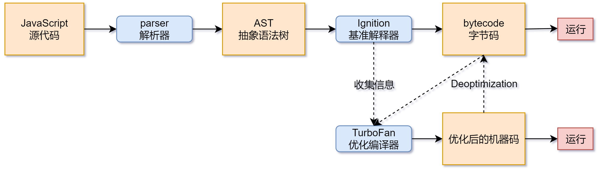
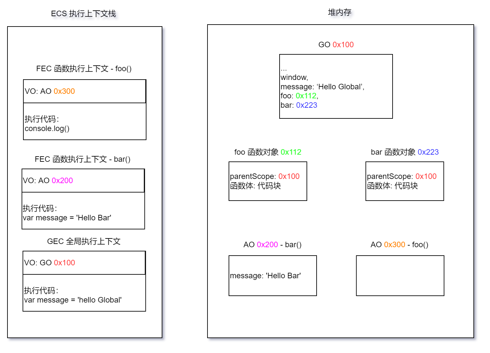
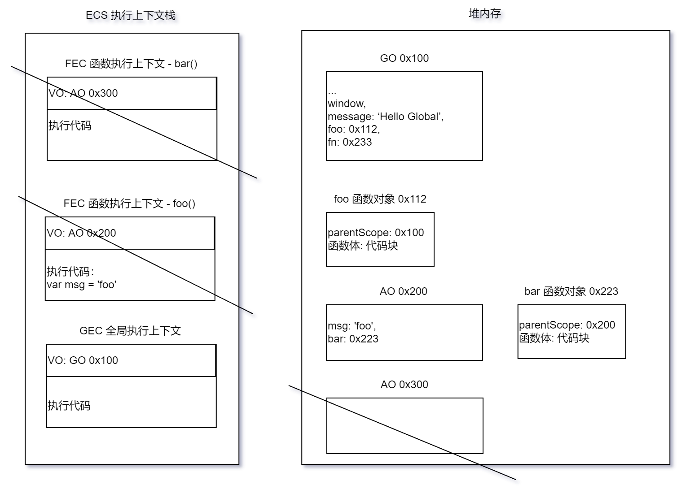

# V8 引擎

## JavaScript 是一门高级语言

在编程语言发展历史来说，有三个阶段：

1. **机器语言**：计算机是基于电工作的，它能理解的就是高低电频所对应的 0101 这种二进制指令，而通过二进制编程的方式就是“机器语言”，这种方式执行效率极高，因为计算机可以无障碍理解，直接运行。
2. **汇编语言**：一个英文标签代表一组二进制指令，这种方式就是“汇编语言”。
3. **高级语言**：站在人的角度，用人类的字符去编写程序。由于高级语言距离硬件很远，计算机不能看懂，所以计算机需要通过编译转换成二进制才能看懂。高级语言中，按照编译方式的不同，又分为两种：
   1. **编译型**：源代码通过编译器（类似于翻译软件），翻译成编译文件，然后计算机通过执行该文件来运行程序。如：C、C++、Java ……
   2. **解释型**：解释器会（类似于翻译官）读取源代码，解释一行，执行一行。如：JavaScript、python ……

> 执行效率：机器语言 > 汇编语言 > 高级语言（编译型 > 解释型）
>
> 开发效率：机器语言 < 汇编语言 < 高级语言（编译型 < 解释型）

## V8 执行 JavaScript

在了解了 JavaScript 是一门高级语言和浏览器的工作流程后，对 JavaScript 引擎也有了基本的认识和自己的理解了，而 [V8 引擎](https://v8.dev/) 就是 JavaScript 引擎的其中一种。



1. JavaScript 经过 V8 引擎的 parser 解析后，会转换成 [AST（抽象语法树）](https://astexplorer.net/)。
2. 接着 AST 经过 Ignition 解释后，会转换成 bytecode（字节码）。
3. bytecode 便可以在不同平台（如：Windows、Linux ……）来运行代码了。

**V8 优化处理**：

- 在 JavaScript 代码解析的过程中，若函数声明但未调用，那么并不会被解析生成 AST。
- 若函数只是被执行一次，bytecode 便会被直接解释执行，不会被 TurboFan 进行优化编译。
- 若函数执行多次，可能会被标记为 **热点代码（hot）**，被编译成优化后的机器码，提高代码的执行性能；

在某些情况下机器码会被逆向还原（Deopmization）成字节码，例如：

```js
function sum(x, y) {
    return x + y
}

sum(1, 2)
sum(2, 3)
sum(3, 4)

sum('hello', 'world') // Deopmization
```

在函数声明时，V8 引擎并不知道对应参数的类型，但是在后续的多次调用中，识别到的是整型，于是 sum 函数被标记为热点函数，解释器将收集到类型信息、函数对应的字节码 …… 发送给编译器，编译器生成优化后的机器码，在之后的调用中，就可以直接运行更快的机器码了。但是此时机器码设定的类型是整型，再调用时，若参数变化成字符型，机器码却不知道如何处理字符型，于是就进行 Deopmization，将机器码还原成字节码，再由解释器来解释执行。

## JavaScript 具体执行过程

**作用域提升** 分析：

```js
var message = 'Hello Global'

function foo() {
  console.log(message)
}

function bar() {
  var message = 'Hello Bar'
  foo()
}

bar()

// 执行结果：Hello Globa
```

1. JavaScript 引擎在执行代码之前，会在 **堆内存** 中创建一个 **GO（全局对象：Global Object）**。
   - 该 GO 对象包含 Date、Math、String、Array、setTimeout、SetInterval …… 其中，还有一个 window 属性指向自己。
2. Javascript 引擎内部还会有一个 **ECS（执行上下文栈：Execution Context Statck）**，它是执行代码的调用栈。
3. 接着会创建一个 **GES（全局执行上下文：Global Execution Context）**，用于执行全局代码，然后压入 ECS 中。
   1. GES 需要一个 **VO（变量对象：Variable Object）**，而此时 VO 对应的就是 GO。
   2. 真正执行代码之前，会将全局变量、函数 …… 添加在 VO 中，此时：
      - 识别到变量，存储的是 undefined。
      - 识别到函数，则会创建一个函数对象，存储的是该函数对象的 **地址值**。且该函数在对象会解析出 **parentScope（父级作用域）**和函数执行体。
   3. 开始真正执行代码：
      - 对变量进行赋值。
      - 若是函数，则会创建一个 **FEC（函数执行上下文：Functional Execution Context）**，并压入 ESC 中。
         - FEC 也需要一个 VO，但该 VO 由 **AO（Activation Object）** 和 父级 VO 组成，也是常说的 **作用域链**，于是会创建一个 AO，该 AO 中包含：形参、arguments、函数定义和 this 指向函数对象、定义的变量 ……
         - 接着开始执行函数体。

> 在最新的 ECMA 版本规范中，对一些词汇进行了修改，比如前面提到的 VO 有了另外一个名称 VE（环境变量：Variable Environment），解释更加宽泛。

流程参考：



## V8 内存管理

任何编程语言，在进行代码执行的时候，都需要对它分配内存，有些是手动分配，有些是自动分配，无论是哪一种，都有如下的生命周期：

1. **申请内存**。
2. **分配内存**。JavaScript 通常情况下是不需要手动申请并分配的。JavaScript 在定义变量时：
   - **基本数据类型** 会在 **栈空间** 中进行分配。
   - **引用数据类型**会在 **栈空间** 存储引用数据类型的 **地址（俗称：引用）**，在 **堆空间** 中进行空间分配。
3. **释放内存**。JavaScript 因为有 **垃圾回收机制（GC）**，所以一般也不需要手动进行回收。

> **常见的 GC 算法**：
>
> 1. **引用计数**：每当有一个引用指向某个对象时，这个对象的引用就 +1，而当引用为 0 时，说明该对象没有被使用过，可以销毁。但是如果两个对象相互引用，那么就会产生“**循环引用**”。
> 2. **标记清除法**：这个算法就是设置一个 **根对象（Root Object）**，垃圾回收期会定期从根开始，寻找有引用的对象，而对于那些没有引用到的对象，就认为之 **不可达对象**，可以销毁。可以解决循环引用的问题。目前 v8 在采用标记清除法的同时，在细节上也结合了其他的算法。

## JavaScript 闭包理解

通俗来讲，JavaScript 中存在一个嵌套函数，且内层函数访问了外层函数定义的变量，那么就形成了一个闭包。

**闭包内存泄漏** 分析：

```js
function foo() {
  var msg = 'foo'
  
  function bar() {
    console.log('bar', msg)
  }
  
  return bar
}

var fn = foo()
fn()

// 解决内存泄漏：改变指向，GC 会识别是否被引用，若未被引用，则会自动释放内存
// fn = null
// foo = null
```



foo() 函数在执行之后，foo() 函数的 FES 在进行销毁后，所对应的 AO 本来应该也是会进行销毁的，但是创建好的 bar() 函数因为被全局 fn 变量所引用，而 bar() 函数的作用域又是处于 foo() 的 AO 下，根据 GC 的标记清除法来看，由于被引用，所以就不会被销毁，于是就产生了内存泄漏的问题！
