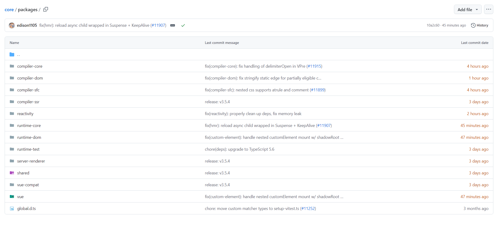

# 前言

## 认识项目结构

Vue3 目录总览，当前记录版本：`v3.5.4`

```sh
├── .github/               # GitHub 配置文件，包含 issue 和 pull request 模板、CI 配置等
├── .vscode/               # VSCode 编辑器相关的配置
├── changelogs/            # 版本更新日志
├── packages-private/      # 一些内部使用的私有包
│   ├── dts-built-test/    # 用于测试构建后的 TypeScript 声明文件
│   ├── dts-test/          # 用于测试 TypeScript 声明文件的正确性
│   ├── sfc-playground/    # 用于单文件组件（SFC）的在线调试工具
│   ├── template-explorer/ # 用于调试和展示模板编译结果的工具
│   ├── vite-debug/        # Vite 调试工具，用于开发和调试 Vite 项目
│   └── tsconfig.json      # TypeScript 项目的全局配置文件（packages-private 子项目的配置）
├── packages/              # Vue 3 核心代码，包含各个模块
│   ├── compiler-core/     # 核心编译器模块，将模板编译为渲染函数
│   ├── compiler-dom/      # 针对 DOM 的编译器模块，编译成适用于浏览器的代码
│   ├── compiler-sfc/      # 用于编译单文件组件（.vue 文件）的模块
│   ├── compiler-ssr/      # 服务端渲染的编译器模块
│   ├── reactivity/        # 响应式系统模块，包括 reactive、ref 等核心功能
│   ├── runtime-core/      # 核心运行时代码，处理组件、渲染器、响应式等
│   ├── runtime-dom/       # 针对 DOM 的运行时，实现浏览器中的 DOM 渲染
│   ├── runtime-test/      # 测试框架，提供测试 Vue 应用的工具
│   ├── server-renderer/   # 服务端渲染模块，用于服务端生成 HTML
│   ├── shared/            # 内部共享的工具函数和类型
│   ├── vue-compat/        # 向后兼容 Vue 2 的代码模块
│   ├── vue/               # Vue 3 的入口，导出完整的 Vue API
├── global.d.ts            # 全局 TypeScript 类型声明文件
├── scripts/               # 脚本文件夹，包含构建、测试等自动化脚本
├── .git-blame-ignore-revs # Git blame 忽略的提交记录
├── .gitignore             # Git 忽略的文件列表
├── .node-version          # Node.js 版本配置文件
├── .prettierignore        # Prettier 格式化忽略的文件
├── .prettierrc            # Prettier 配置文件
├── BACKERS.md             # 支持者名单
├── CHANGELOG.md           # 版本变更日志
├── FUNDING.json           # 项目资助相关配置
├── LICENSE                # 许可证信息
├── README.md              # 项目简介和使用说明
├── SECURITY.md            # 安全相关的报告指南
├── eslint.config.js       # ESLint 配置文件
├── netlify.toml           # Netlify 部署配置文件
├── package.json           # 项目依赖及元数据信息
├── pnpm-lock.yaml         # PNPM 依赖锁定文件
├── pnpm-workspace.yaml    # PNPM 工作空间配置
├── rollup.config.js       # Rollup 构建工具的配置
├── rollup.dts.config.js   # Rollup 用于生成 TypeScript 类型声明的配置
├── tsconfig.build.json    # TypeScript 构建配置文件
├── tsconfig.json          # TypeScript 项目全局配置文件
├── vitest.config.ts       # Vitest 测试框架的全局配置
├── vitest.e2e.config.ts   # Vitest 端到端测试配置
├── vitest.unit.config.ts  # Vitest 单元测试配置
├── vitest.workspace.ts    # Vitest 工作区配置

```

由 [Vue3 源码](https://github.com/vuejs/core/tree/main/packages) 可知，核心大致可分为 3 个部分：

1. 响应式：reactivity
2. 编译时：compiler
3. 运行时：runtime


